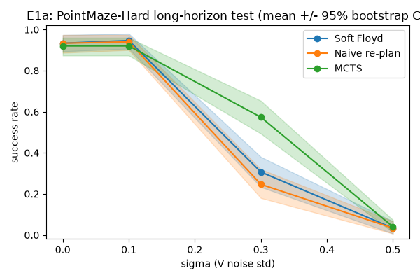
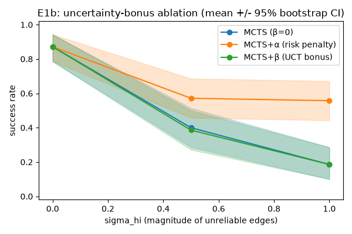

# MCTS-over-Landmarks: robust planning khi ước lượng khoảng cách bị nhiễu

> Mở rộng nghiên cứu cho L³P (*World Model as a Graph*, ICML 2021). Thay planner
> Soft Floyd tất định bằng **MCTS trên graph landmark**, và đo xem MCTS có ra
> quyết định **bền vững hơn khi ước lượng khoảng cách `V` bị nhiễu** hay không.
> Tài liệu này tổng hợp *phương pháp*, *ba thí nghiệm E1a/E1b/E1c*, và **lý giải
> vì sao chọn từng kỹ thuật**. Spec gốc: [`docs/SPEC_MCTS_Landmark_L3P.md`](docs/SPEC_MCTS_Landmark_L3P.md).

---

## 0. Tóm tắt kết quả

| Thí nghiệm | Loại nhiễu | Câu hỏi | Kết quả |
|---|---|---|---|
| **E1a** | Loại-2 đồng nhất | MCTS + sample-rollout có bền hơn Soft Floyd? | ✅ Ở σ=0.3, MCTS **0.57** vs Floyd **0.31** (CI tách). Thắng nhờ *lookahead*. |
| **E1b** | Loại-2 dị biệt (oracle) | Uncertainty bonus có đóng góp riêng? | ✅ **α (né rủi ro) thắng** (0.56 vs 0.19 ở σ=1.0); **β (thăm dò) vô ích**. |
| **E1c** | Loại-1 (bias hệ thống) | MCTS phát hiện bias qua execution? | ✅ MCTS+feedback **0.82** vs Floyd **0.58** ở σ=0.3; **lookahead-một-mình (0.45) còn hại**. |

Ba thí nghiệm phủ ba cơ chế robustness khác nhau, và mỗi cái tách được một biến
gây nhiễu khác nhau (xem §7).

---

## 1. Vì sao mở rộng L³P

L³P học một **world-model dạng graph**: các *latent landmark* rải trên goal space,
nối bằng ước lượng khoảng cách (reachability) `V(g₁,g₂)` chưng cất từ Q-function.
Planner của L³P là **Soft Floyd** (Floyd–Warshall mềm) — tính đường đi ngắn nhất
*một lần* đầu episode rồi commit.

**Điểm yếu L³P tự thừa nhận:** *"neural distance estimates are not entirely
accurate"*. Soft Floyd **tin `V` một cách tất định**: nếu `V` sai (một cạnh nhìn
ngắn giả — "wormhole", L³P Fig. 6), planner lao vào và không có cơ chế sửa.

> **Câu hỏi nghiên cứu:** *Khi `V` là ước lượng nhiễu, MCTS (explore/exploit qua
> UCB, sample-based rollout, uncertainty-aware) có ra quyết định robust hơn Soft
> Floyd không?* Nếu có, insight chuyển thẳng sang VLA (world-model cũng nhiễu y hệt).
>
> **Tiêu chí thành công:** hai đường `success-rate vs σ` **tách nhau** khi σ tăng,
> **VÀ trùng nhau tại σ=0** (sanity check bắt buộc).

---

## 2. Kiến trúc phân tầng — và vì sao giữ nguyên

Hệ thống có **2 tầng thời gian**. MCTS chỉ hoạt động ở **tầng cao (macro)**, chọn
landmark kế tiếp; việc đi giữa 2 landmark giao cho **low-level policy π** (đã học
qua HER) tự navigate. Đây là *temporal abstraction* của L³P.

```
HIGH-LEVEL (MCTS)  — "đi tới landmark nào tiếp?"  | rời rạc, N landmark (+goal)
      ↓ subgoal = f_D(landmark)
LOW-LEVEL (π, HER) — "đi thế nào?"                | action liên tục, 1 env.step
```

**Vì sao KHÔNG để MCTS plan từng action:** (1) sẽ quay lại đúng bài toán horizon-500
mà L³P né được; (2) latent space được huấn luyện để khoảng cách phản ánh
reachability → 2 landmark liền kề là điểm π *tin cậy đi được* trong tầm ngắn
(`d_max` cutoff đảm bảo); (3) chính vì π tự đi nên `V` chỉ là *ước tính* — đây là
nguồn uncertainty ta nghiên cứu.

---

## 3. MCTS-over-landmarks — phương pháp & lý giải

Sau khi có `N` landmark, không gian search là **hữu hạn** → UCT cổ điển áp dụng
trực tiếp. Code: [`l3p/planning/mcts_planner.py`](l3p/planning/mcts_planner.py)
(`LandmarkMCTS`, `MCTSPlanner`).

| Pha | Làm gì | **Vì sao** |
|---|---|---|
| **Root** | Node gốc = *state thật* hiện tại; cạnh gốc = `d_{s→c}` từ critic `D` (sạch, không nhiễu) | `D(s,π,c)` được tính lại mỗi replan từ state thật → không cần nhiễu; chỉ **graph landmark-landmark** (thứ được ghép nối qua horizon dài) mới là nơi `V` nhiễu — đúng chỗ cần test. |
| **Selection (UCT)** | `argmax_j [ Q(node,j) + c·√(ln N/n_j) ]` | Cân bằng exploit (Q) và explore. Dấu nhất quán với toàn codebase: "ít âm hơn = tốt hơn". |
| **Expansion** | Thêm 1 landmark con chưa thử (trong tập *admissible*) | — |
| **Simulation (rollout)** | Từ node mới, greedy theo Soft-Floyd heuristic `d_{c→g}` tới goal/hết horizon; **sample `V` mỗi lần dùng** | Rollout = "dynamics model" rẻ (1 forward MLP). Sample `V` mỗi lần = **lập luận về kỳ vọng dưới transition stochastic** (chính là điều Soft Floyd bỏ qua). |
| **Backprop** | Cộng dồn chi phí (âm) lên đường đã đi | — |
| **Chọn action cuối** | **Robust child** = max visit count (tie-break bằng Q), KHÔNG chỉ max-Q | **Vì sao robust:** tránh exploit một nhánh may mắn nhờ noise; visit count trung bình hoá nhiễu tốt hơn Q đơn lẻ. |

**Hai bất biến quan trọng (và vì sao):**

- **`d_max` masking là thuộc tính CẤU TRÚC, quyết định 1 lần/episode — không resample.**
  Soft Floyd dùng softmax nên logit bị mask (`neg_inf`) tự tan về trọng số ~0. MCTS
  backup **trung bình cộng**, nên nếu để cạnh bị mask đóng góp chi phí cỡ `neg_inf`
  vào trung bình đó thì nó nuốt chửng tất cả. → tách rõ "cạnh có tồn tại không"
  (mask tĩnh) khỏi "chi phí cạnh bao nhiêu" (resample mỗi lần). *Bug này từng làm
  test sanity fail với `mean_q ≈ -10063` thay vì `-3`; sửa xong khớp chính xác Soft Floyd.*
- **`d_max` phải TUNE theo scale của `V` từng checkpoint** (xem §6) — spec R3.

---

## 4. Mô hình nhiễu — vì sao cần ba loại

Ước lượng `V` sai theo **hai bản chất khác nhau**, test **năng lực khác nhau**.
Code: [`l3p/planning/noise.py`](l3p/planning/noise.py).

| | **Loại 2 — execution stochasticity** | **Loại 1 — estimation bias** |
|---|---|---|
| Công thức | `V_obs = V_true + η`, `η~N(0,σ²)` **resample mỗi lần** | `V_obs = V_true·(1+b)`, `b~N(0,σ²)` **cố định 1 lần/episode** |
| Mô phỏng | π không tất định (cùng cặp, lần 20 bước lần 25) | world-model học SAI hệ thống vài cạnh ("wormhole") |
| MCTS thắng nhờ | **sample rollout** → ước tính kỳ vọng đúng | **execution feedback** → phát hiện bias, sửa |
| Vì sao Soft Floyd thua | dùng điểm ước tính, bỏ qua variance | tin edge bias một lần, không sửa |

**Vì sao Loại-2 phải làm trước (E1a/E1b):** khớp trực tiếp với thiết kế
rollout sample-based. **Loại-1 (E1c) khó hơn** vì bias cố định → **trung bình hoá
KHÔNG cứu được** → bắt buộc phải có cơ chế "học từ thực thi" (§5).

**Ba nơi `V` xuất hiện** — và ta chỉ tiêm nhiễu ở Nơi 1&2, giữ Nơi 3 sạch:
```
Nơi 1: planner nhìn thấy (chọn đường)         → V_obs
Nơi 2: rollout bên trong MCTS (đánh giá đường) → V_sampled
Nơi 3: MÔI TRƯỜNG THẬT (agent đi mất bao nhiêu bước) → V_true  ← GIỮ SẠCH
```
**Vì sao giữ Nơi 3 sạch:** để **so sánh công bằng** — cả MCTS và Floyd bị "lừa"
bởi cùng một estimate nhiễu, nhưng success đo trên env thật. Khác biệt duy nhất là
*cách xử lý* estimate nhiễu, không phải env khác nhau.

**Nhiễu dị biệt (E1b), `build_sigma_matrix`:** thay vì mọi cạnh cùng σ, chỉ một
phần `frac_high` cạnh có σ cao, **decorrelated với `V`** (cạnh *nhìn ngắn* có thể
bí mật *không tin cậy*). **Vì sao cần decorrelation:** nếu σ đồng nhất thì uncertainty
là hằng số → bonus vô nghĩa; phải có cạnh "bẫy" thì "biết-mà-né" mới có giá trị.

---

## 5. Đưa uncertainty vào MCTS — hai lựa chọn, và execution feedback

### 5.1. Reward macro-step và hai chỗ nhét uncertainty (E1b)
```
R(cᵢ→cⱼ) = −V(cᵢ,cⱼ) + λ_goal·1[cⱼ=goal] − λ_risk·Unc(cᵢ,cⱼ)
```
- **Lựa chọn α — trong reward** (`−λ_risk·Unc`): phạt cạnh bất định → **né rủi ro**.
- **Lựa chọn β — trong UCT** (`+β·σ_V`): thưởng thăm dò cạnh bất định → **thu thập
  thông tin** (giảm bất định qua simulation).

**Vì sao hiện thực CẢ HAI:** để trả lời câu phụ *"nên coi uncertainty là
risk-to-avoid hay information-to-gather?"* — chỉ ablate được khi có cả hai.

> **Lưu ý cấu trúc (giải thích kết quả E1b):** α sửa **cost cạnh** → chảy vào Q của
> root child → **đổi được subgoal chọn**. β chỉ áp ở **node sâu** (cạnh gốc sạch,
> không có oracle σ) và chỉ đổi *thứ tự thăm dò* — mà planner chỉ *thực thi macro-step
> đầu tiên*. Trong planner một-macro-step, **phải đổi GIÁ TRỊ backup lên root mới đổi
> được hành vi** → α có đòn bẩy, β gần như không.

### 5.2. Execution feedback (E1c, §4 của spec)
Dưới bias Loại-1, sample rollout vô dụng (bias cố định). Cơ chế thắng: **đi thử →
đo chi phí thật → sửa**. Code: `FeedbackMCTSPlanner`.

1. **Snap-to-nearest (§4.2):** gán state hiện tại về landmark gần nhất `i`.
2. **Đo realized cost (§4.3):** `realized = k_used + max(0, −V(z_end, c_j))` (số bước
   env thật + phần dư), rồi **EMA**: `V_exec[i][j] ← (1−ρ)·prev + ρ·realized`.
3. **Rebuild d_c2g mỗi macro-step** với `V_exec` đã sửa → planner "học" trong episode.
4. **Loop guard (§4.4):** blacklist cạnh thất bại quá `r_max` lần (STUCK → ngay lập tức).

> **Vì sao đây là chỗ MCTS *hơn* Soft Floyd một cách bản chất:** Soft Floyd tính path
> 1 lần, không sửa; MCTS **học từ execution thật** và điều chỉnh — đúng điểm yếu L³P
> tự thừa nhận.

**Vì sao E1c dựng graph trên critic-`D` (không phải `V`):** feedback blend
`realized_cost` (đơn vị **bước env**) vào ước lượng cạnh. Nhưng `agent.value` (V) ở
checkpoint này **nén ~10×** so với `D` (xem §6) → blend số-bước vào V-nén sẽ **sai
đơn vị**. Dùng critic-`D` (chính xác, đúng scale bước env) làm substrate → bias là
lỗi *duy nhất* được tiêm, và feedback sửa được **không lệch đơn vị**.

---

## 6. Giao thức công bằng — và vì sao bắt buộc

Spec cảnh báo R3: *"phải tune Soft Floyd công bằng, nếu không reviewer nghi ngờ"*.

- **`d_max` auto-calibrate (mỗi run):** `d_max` mặc định = 20 (từ paper, hợp scale
  AntMaze) nhưng **SAI** cho checkpoint này: `V∈[0.5,4]`, critic `D` median ~12.
  Với `d_max=20`, **không cạnh nào bị mask** → Soft Floyd không ghép được multi-hop
  → planner misroute → **success = 0.00** (dù flat policy đạt 0.9!). Sửa: quét `d_max`
  (percentile của phân phối `V`), chọn giá trị tối đa hoá **Soft Floyd sạch**, rồi
  **dùng chung cho MỌI nhánh**. → không confound "MCTS thắng nhờ tune tốt hơn".
  *Vực thẳm sắc:* E1a chọn `d_max≈0.68`, và `d_max≥1.0` → 0.00.
- **Paired per-episode:** cùng `(σ, seed, episode)` → cả 3 nhánh thấy **cùng start/goal**
  và **cùng seed nhiễu**. Chỉ khác *thuật toán*.
- **Mean ± 95% bootstrap CI** trên các outcome gộp qua seed (spec §10).
- **Sanity σ=0 bắt buộc:** không nhiễu → các nhánh phải trùng. Nếu không → có bug,
  dừng (spec KB3).

---

## 7. Thí nghiệm

**Môi trường:** `PointMaze-Hard` (NumPy thuần, không MuJoCo), long-horizon test
(start↔goal hai đầu, horizon 500). **Checkpoint:** `checkpoint/l3p_pointmaze_full.pt` (train
500k steps, 50 landmark). Config nền: γ=0.98, N=50 landmark, embedding=16,
hidden 3×256 (Appendix-E). Chi tiết: [`l3p/config.py`](l3p/config.py).

**Đặc tính checkpoint (đo được):** `V` nén (median ~1.5, max ~4.65), critic `D`
median ~12 → **D/V ≈ 10×**. Lý do E1c chuyển substrate sang `D`.

### E1a — sample rollout dưới nhiễu đồng nhất
Loại-2 đồng nhất, Nơi 1&2 · 3 seed × 50 eps (n=150/điểm) · d_max=0.68 · 200 sims ·
so: Soft Floyd / Naive-replan / MCTS. `scripts/run_e1a.py`.



| σ | Soft Floyd | Naive re-plan | MCTS |
|---|---|---|---|
| 0.0 | 0.93 [0.89,0.97] | 0.93 [0.89,0.97] | 0.92 [0.87,0.96] |
| 0.1 | 0.95 [0.91,0.98] | 0.94 [0.90,0.97] | 0.92 [0.87,0.96] |
| **0.3** | **0.31 [0.23,0.38]** | **0.25 [0.18,0.32]** | **0.57 [0.49,0.65]** |
| 0.5 | 0.03 [0.01,0.07] | 0.03 [0.01,0.07] | 0.04 [0.01,0.07] |

**Đọc:** ở σ=0.3, MCTS (0.57) **tách CI** khỏi Soft Floyd (0.31) và cũng vượt hẳn
Naive-replan (0.25) → lợi thế đến từ **tree-search/rollout**, KHÔNG phải "replan
thường xuyên hơn" (Naive replan mỗi bước mà tệ nhất). Ở σ=0.5 mọi thứ về sàn
(nhiễu quá lớn, task bất khả) — lợi thế nằm ở **cửa sổ nhiễu trung bình**.
**Vì sao có `Naive re-plan`:** đúng baseline spec §7 yêu cầu để tách biến "re-plan".

### E1b — uncertainty bonus (α vs β) dưới nhiễu dị biệt oracle
Loại-2 dị biệt (frac_high=0.6, oracle σ) · 2 seed × 35 eps (n=70) · d_max=0.68 ·
100 sims · λ_risk=3, β_unc=1 · so: MCTS none/α/β. `scripts/run_e1b.py`.



| σ_hi | MCTS (β=0) | MCTS+α (né rủi ro) | MCTS+β (thăm dò) |
|---|---|---|---|
| 0.0 | 0.87 [0.79,0.94] | 0.87 [0.79,0.94] | 0.87 [0.79,0.94] |
| 0.5 | 0.40 [0.29,0.51] | 0.57 [0.46,0.69] | 0.39 [0.27,0.50] |
| **1.0** | **0.19 [0.10,0.29]** | **0.56 [0.44,0.67]** | **0.19 [0.10,0.29]** |

**Đọc:** **α (né rủi ro) thắng rõ** (0.56 vs β=0 0.19 ở σ=1.0, CI tách; gap nới rộng
theo σ). **β (thăm dò) đóng góp = 0** (trùng khít β=0). → Trong bối cảnh này
uncertainty là **risk-to-avoid**, không phải information-to-gather. β vô ích vì
(1) chỉ áp node sâu không được thực thi, (2) σ oracle cố định — thăm dò không "giảm"
được gì (xem lý giải cấu trúc §5.1).

### E1c — execution feedback dưới bias hệ thống
Loại-1 bias · substrate critic-`D` · 2 seed × 30 eps (n=60) · d_max=0.998 · 80 sims ·
ρ=0.5, τ_reach=2, τ_progress=3, r_max=2 · so: Soft Floyd / MCTS no-fb / MCTS+fb.
`scripts/run_e1c.py`.


| σ_bias | Soft Floyd (tĩnh) | MCTS no-feedback | MCTS + feedback |
|---|---|---|---|
| 0.0 | 0.87 [0.78,0.95] | 0.93 [0.87,0.98] | 0.93 [0.87,0.98] |
| 0.1 | 0.80 [0.70,0.90] | 0.87 [0.78,0.95] | 0.95 [0.88,1.00] |
| **0.3** | **0.58 [0.47,0.70]** | **0.45 [0.33,0.58]** | **0.82 [0.72,0.90]** |

**Đọc:** MCTS+feedback (0.82) **vượt** Soft Floyd (0.58) ở σ=0.3 (CI vừa tách);
gap nới rộng theo bias. **MCTS no-feedback (0.45) TỆ NHẤT** — plain lookahead đào
sâu vào wormhole còn hại hơn Soft Floyd tĩnh. → Phần thắng đến từ **feedback**, KHÔNG
phải lookahead. Đây là control quan trọng nhất của E1c.

---

## 8. Tổng hợp — ba cơ chế robustness

| | Nhiễu | Cơ chế cứu | Kết luận |
|---|---|---|---|
| E1a | stochastic đồng nhất | **sample rollout** (lookahead) | MCTS > Soft Floyd ở cửa sổ nhiễu trung bình |
| E1b | stochastic dị biệt (oracle) | **α né rủi ro** | biết uncertainty → *né* giúp, *thăm dò* không |
| E1c | bias hệ thống | **execution feedback** | học từ thực thi → sửa bias; lookahead-một-mình hại |

Ba loại nhiễu đòi ba cơ chế khác nhau; MCTS-over-landmarks là framework duy nhất
gộp được cả ba (Soft Floyd tất định không làm được cái nào ngoài trường hợp `V` sạch).

---

## 9. Hạn chế (trung thực)

- **Một checkpoint, env PointMaze** mà spec đánh dấu R2 "dễ" (flat policy ~0.9) →
  margin planning mỏng. Để tuyên bố chắc cần lặp trên env khó hơn (AntMaze, cần MuJoCo).
- **E1b/E1c dùng oracle-ish uncertainty:** E1b cho MCTS biết chính xác σ_ij; E1c
  feedback là thật (từ execution) nhưng trên substrate critic-`D`. Chưa test uncertainty
  *ước lượng qua ensemble* (spec Cách 2).
- **E1c: τ_progress=3, τ_reach=2 CHƯA quét** (spec §4.1 bảo nên quét τ_progress).
  Kết quả mạnh nhưng nên kiểm độ nhạy trước khi chốt claim.
- **σ đến từ chính ta inject**, không phải nhiễu tự nhiên của một world-model học thật.
- Hyperparameter α/β (λ_risk=3, β_unc=1), ρ=0.5, r_max=2 đặt theo lý lẽ (§ trong
  code) nhưng phần lớn **chưa quét**.

---

## 10. Tái lập

```bash
python tests/test_modules.py                              # 25 unit test (bao gồm MCTS/noise/feedback)

python scripts/run_e1a.py --load checkpoint/l3p_pointmaze_full.pt --seeds 0 1 2 --episodes 50 --sigmas 0 0.1 0.3 0.5
python scripts/run_e1b.py --load checkpoint/l3p_pointmaze_full.pt --seeds 0 1 --episodes 35 --sigma-hi 0 0.5 1.0 --frac-high 0.6 --mcts-n-simulations 100
python scripts/run_e1c.py --load checkpoint/l3p_pointmaze_full.pt --seeds 0 1 --episodes 30 --sigmas 0 0.1 0.3 --mcts-n-simulations 80
```
Kết quả (JSON + PNG) lưu ở `logs/e1{a,b,c}_*`. Mỗi run tự calibrate `d_max`, chạy
sanity σ=0, xuất mean±CI + đường cong shaded-band.

---

## 11. Bản đồ code

| File | Vai trò |
|---|---|
| `l3p/planning/mcts_planner.py` | `LandmarkMCTS` (UCT/rollout/backprop + α/β bonus), `MCTSPlanner`, `UncertaintyMCTSPlanner` (E1b), `FeedbackMCTSPlanner` + `SoftFloydE1c` (E1c) |
| `l3p/planning/noise.py` | `NoisyValueFn` (Loại-2 đồng nhất), `HeterogeneousNoise`+`build_sigma_matrix` (E1b), `BiasedValueFn`+`build_bias_matrix`+`CriticEdgeFn` (E1c), `dmax_candidates`, `bootstrap_ci`, `ValueOverrideAgent` |
| `l3p/planning/baselines.py` | `NaiveReplanPlanner` (Baseline 2) |
| `l3p/planning/{graph_search,planner}.py` | Soft Floyd + Algorithm 1 gốc (KHÔNG sửa) |
| `scripts/run_e1{a,b,c}.py` | Harness thí nghiệm (calibrate d_max, paired eval, CI, plot) |
| `tests/test_modules.py` | Unit test cho mọi thành phần mới |
