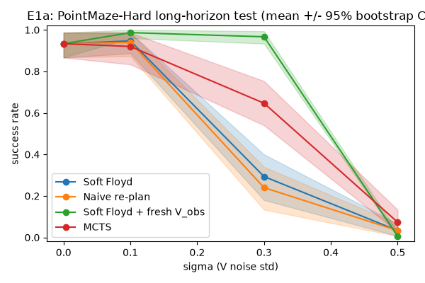
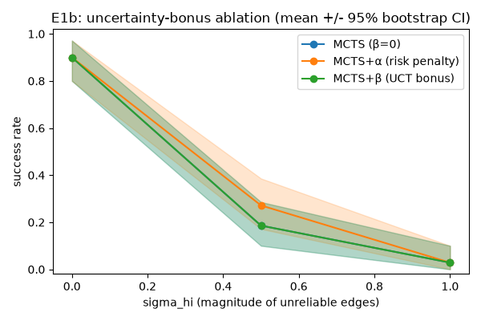
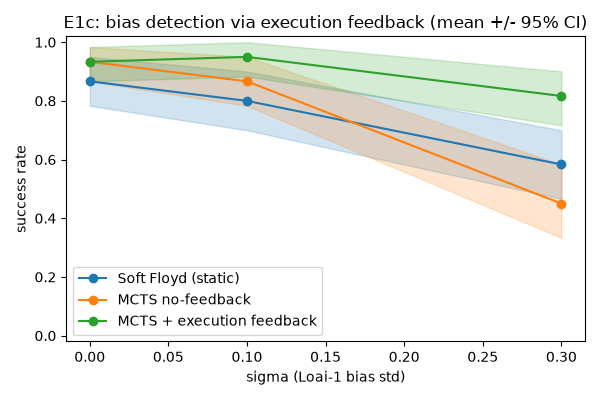
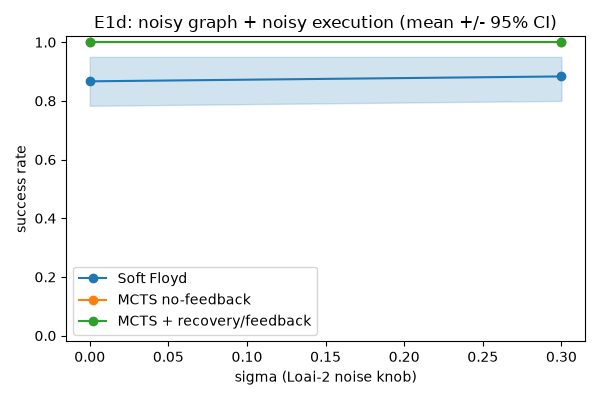

# MCTS-over-Landmarks: robust planning khi ước lượng khoảng cách bị nhiễu

> Mở rộng nghiên cứu cho L³P (*World Model as a Graph*, ICML 2021). Thay planner
> Soft Floyd tất định bằng **MCTS trên graph landmark**, và đo xem MCTS có ra
> quyết định **bền vững hơn khi ước lượng khoảng cách `V` bị nhiễu** hay không.
> Tài liệu này tổng hợp *phương pháp*, *bốn thí nghiệm E1a/E1b/E1c/E1d*, và **lý giải
> vì sao chọn từng kỹ thuật**. Spec gốc: [`docs/SPEC_MCTS_Landmark_L3P.md`](docs/SPEC_MCTS_Landmark_L3P.md).

> **Trạng thái 2026-07-29:** E1a-E1d đã được chạy lại sau correctness review.
> Kết quả corrected nằm tại
> `logs/e1_correctness_rerun_20260728/pointmaze_numpy/`. Mỗi điểm lưu raw
> per-episode outcomes, hierarchical-bootstrap CI và plot. E1d đã được lặp lại
> độc lập; outcomes và mọi thống kê không phải timing khớp chính xác.

---

## 0. Tóm tắt kết quả

| Thí nghiệm | Loại nhiễu | Câu hỏi | Kết quả |
|---|---|---|---|
| **E1a** | Loại-2 đồng nhất | MCTS + sample-rollout có bền hơn Soft Floyd? | **Có so với static Floyd:** ở σ=0.3, MCTS **0.65** vs Floyd **0.29**. Nhưng fresh-`V_obs` replan đạt **0.97**, nên MCTS không phải baseline tốt nhất. |
| **E1b** | Loại-2 dị biệt (oracle) | Uncertainty bonus có đóng góp riêng? | **Chưa đủ bằng chứng:** α đạt 0.27 vs none 0.19 ở σ_hi=0.5 nhưng CI chồng lấn; tại 1.0 cả ba cùng 0.03. β không có lợi ích. |
| **E1c** | Loại-1 (bias hệ thống) | Feedback có phát hiện/sửa bias? | ✅ Ở σ=0.3 feedback **0.87** > Floyd 0.52 > no-feedback 0.43 (CI tách); robust qua sweep τ. (Kết quả âm 0.43 trước đây là artifact của bug goal-blacklist, đã fix.) |
| **E1d** | Loại-2 tại Nơi 1,2,3 | Recovery/feedback có giúp khi execution nhiễu? | Sau fix: feedback **1.00** ≥ no-fb 0.97 ≥ Floyd 0.90 (KHÔNG hại; con 0.33 cũ là artifact bug). Nhưng σ=0.3 mọi nhánh gần trần → chưa đủ căng để tách. |

**Bức tranh sau khi fix bug goal-blacklist (2026-07-29):** **E1c là claim tích cực
mạnh nhất** (feedback 0.87 > Floyd 0.52, CI tách, robust qua τ). **E1d**: feedback
không còn gây hại (1.00 ≥ 0.97 ≥ 0.90) — con âm 0.33 trước đây là artifact bug —
nhưng σ=0.3 mọi nhánh gần trần nên chưa phân giải. **E1a**: MCTS > Soft Floyd tĩnh
nhưng **thua fresh-graph-replan** (nhiễu 0-mean thì replan-mỗi-bước ăn đứt). **E1b**:
tín hiệu α yếu ở frac_high=0.3 (mạnh hơn ở frac_high=0.6). Chi tiết §7-9.

---

## 1. Vì sao mở rộng L³P

L³P học một **world-model dạng graph**: các *latent landmark* rải trên goal space,
nối bằng ước lượng khoảng cách (reachability) `V(g₁,g₂)` chưng cất từ Q-function.
Planner của L³P là **Soft Floyd** (Floyd–Warshall mềm) — tính đường đi ngắn nhất
*một lần* đầu episode rồi commit.

**Điểm yếu L³P tự thừa nhận:** *"neural distance estimates are not entirely
accurate"*. Soft Floyd **tin `V` một cách tất định**: nếu `V` sai (một cạnh nhìn
ngắn giả — "wormhole", L³P Fig. 6), planner lao vào và không có cơ chế sửa.

> **Câu hỏi nghiên cứu:** *Khi `V` là ước lượng nhiễu, MCTS (explore/exploit qua
> UCB, sample-based rollout, uncertainty-aware) có ra quyết định robust hơn Soft
> Floyd không?* Nếu có, insight chuyển thẳng sang VLA (world-model cũng nhiễu y hệt).
>
> **Tiêu chí thành công:** hai đường `success-rate vs σ` **tách nhau** khi σ tăng,
> **VÀ trùng nhau tại σ=0** (sanity check bắt buộc).

---

## 2. Kiến trúc phân tầng — và vì sao giữ nguyên

Hệ thống có **2 tầng thời gian**. MCTS chỉ hoạt động ở **tầng cao (macro)**, chọn
landmark kế tiếp; việc đi giữa 2 landmark giao cho **low-level policy π** (đã học
qua HER) tự navigate. Đây là *temporal abstraction* của L³P.

```
HIGH-LEVEL (MCTS)  — "đi tới landmark nào tiếp?"  | rời rạc, N landmark (+goal)
      ↓ subgoal = f_D(landmark)
LOW-LEVEL (π, HER) — "đi thế nào?"                | action liên tục, 1 env.step
```

**Vì sao KHÔNG để MCTS plan từng action:** (1) sẽ quay lại đúng bài toán horizon-500
mà L³P né được; (2) latent space được huấn luyện để khoảng cách phản ánh
reachability → 2 landmark liền kề là điểm π *tin cậy đi được* trong tầm ngắn
(`d_max` cutoff đảm bảo); (3) chính vì π tự đi nên `V` chỉ là *ước tính* — đây là
nguồn uncertainty ta nghiên cứu.

---

## 3. MCTS-over-landmarks — phương pháp & lý giải

Sau khi có `N` landmark, không gian search là **hữu hạn** → UCT cổ điển áp dụng
trực tiếp. Code: [`l3p/planning/mcts_planner.py`](l3p/planning/mcts_planner.py)
(`LandmarkMCTS`, `MCTSPlanner`).

| Pha | Làm gì | **Vì sao** |
|---|---|---|
| **Root** | Node gốc = *state thật* hiện tại; cạnh gốc = `d_{s→c}` từ critic `D` (sạch, không nhiễu) | `D(s,π,c)` được tính lại mỗi replan từ state thật → không cần nhiễu; chỉ **graph landmark-landmark** (thứ được ghép nối qua horizon dài) mới là nơi `V` nhiễu — đúng chỗ cần test. |
| **Selection (UCT)** | `argmax_j [ Q(node,j) + c·√(ln N/n_j) ]` | Cân bằng exploit (Q) và explore. Dấu nhất quán với toàn codebase: "ít âm hơn = tốt hơn". |
| **Expansion** | Thêm 1 landmark con chưa thử (trong tập *admissible*) | — |
| **Simulation (rollout)** | Từ node mới, greedy theo Soft-Floyd heuristic `d_{c→g}` tới goal/hết horizon; **sample `V` mỗi lần dùng** | Rollout = "dynamics model" rẻ (1 forward MLP). Sample `V` mỗi lần = **lập luận về kỳ vọng dưới transition stochastic** (chính là điều Soft Floyd bỏ qua). |
| **Backprop** | Cộng dồn chi phí (âm) lên đường đã đi | — |
| **Chọn action cuối** | **Robust child** = max visit count (tie-break bằng Q), KHÔNG chỉ max-Q | **Vì sao robust:** tránh exploit một nhánh may mắn nhờ noise; visit count trung bình hoá nhiễu tốt hơn Q đơn lẻ. |

**Hai bất biến quan trọng (và vì sao):**

- **`d_max` masking là thuộc tính CẤU TRÚC, quyết định 1 lần/episode — không resample.**
  Soft Floyd dùng softmax nên logit bị mask (`neg_inf`) tự tan về trọng số ~0. MCTS
  backup **trung bình cộng**, nên nếu để cạnh bị mask đóng góp chi phí cỡ `neg_inf`
  vào trung bình đó thì nó nuốt chửng tất cả. → tách rõ "cạnh có tồn tại không"
  (mask tĩnh) khỏi "chi phí cạnh bao nhiêu" (resample mỗi lần). *Bug này từng làm
  test sanity fail với `mean_q ≈ -10063` thay vì `-3`; sửa xong khớp chính xác Soft Floyd.*
- **`d_max` phải TUNE theo scale của `V` từng checkpoint** (xem §6) — spec R3.

---

## 4. Mô hình nhiễu — vì sao cần ba loại

Ước lượng `V` sai theo **hai bản chất khác nhau**, test **năng lực khác nhau**.
Code: [`l3p/planning/noise.py`](l3p/planning/noise.py).

| | **Loại 2 — execution stochasticity** | **Loại 1 — estimation bias** |
|---|---|---|
| Công thức | `V_obs = V_true + η`, `η~N(0,σ²)` **resample mỗi lần** | `V_obs = V_true·(1+b)`, `b~N(0,σ²)` **cố định 1 lần/episode** |
| Mô phỏng | π không tất định (cùng cặp, lần 20 bước lần 25) | world-model học SAI hệ thống vài cạnh ("wormhole") |
| MCTS thắng nhờ | **sample rollout** → ước tính kỳ vọng đúng | **execution feedback** → phát hiện bias, sửa |
| Vì sao Soft Floyd thua | dùng điểm ước tính, bỏ qua variance | tin edge bias một lần, không sửa |

**Vì sao Loại-2 phải làm trước (E1a/E1b):** khớp trực tiếp với thiết kế
rollout sample-based. **Loại-1 (E1c) khó hơn** vì bias cố định → **trung bình hoá
KHÔNG cứu được** → bắt buộc phải có cơ chế "học từ thực thi" (§5).

**Ba nơi `V` xuất hiện** — và ta chỉ tiêm nhiễu ở Nơi 1&2, giữ Nơi 3 sạch:
```
Nơi 1: planner nhìn thấy (chọn đường)         → V_obs
Nơi 2: rollout bên trong MCTS (đánh giá đường) → V_sampled
Nơi 3: MÔI TRƯỜNG THẬT (agent đi mất bao nhiêu bước) → V_true  ← GIỮ SẠCH
```
**Vì sao giữ Nơi 3 sạch:** để **so sánh công bằng** — cả MCTS và Floyd bị "lừa"
bởi cùng một estimate nhiễu, nhưng success đo trên env thật. Khác biệt duy nhất là
*cách xử lý* estimate nhiễu, không phải env khác nhau.

**Nhiễu dị biệt (E1b), `build_sigma_matrix`:** thay vì mọi cạnh cùng σ, chỉ một
phần `frac_high` cạnh có σ cao, **decorrelated với `V`** (cạnh *nhìn ngắn* có thể
bí mật *không tin cậy*). **Vì sao cần decorrelation:** nếu σ đồng nhất thì uncertainty
là hằng số → bonus vô nghĩa; phải có cạnh "bẫy" thì "biết-mà-né" mới có giá trị.

---

## 5. Đưa uncertainty vào MCTS — hai lựa chọn, và execution feedback

### 5.1. Reward macro-step và hai chỗ nhét uncertainty (E1b)
```
R(cᵢ→cⱼ) = −V(cᵢ,cⱼ) + λ_goal·1[cⱼ=goal] − λ_risk·Unc(cᵢ,cⱼ)
```
- **Lựa chọn α — trong reward** (`−λ_risk·Unc`): phạt cạnh bất định → **né rủi ro**.
- **Lựa chọn β — trong UCT** (`+β·σ_V`): thưởng thăm dò cạnh bất định → **thu thập
  thông tin** (giảm bất định qua simulation).

**Vì sao hiện thực CẢ HAI:** để trả lời câu phụ *"nên coi uncertainty là
risk-to-avoid hay information-to-gather?"* — chỉ ablate được khi có cả hai.

> **Lưu ý cấu trúc (giải thích kết quả E1b):** α sửa **cost cạnh** → chảy vào Q của
> root child → **đổi được subgoal chọn**. β chỉ áp ở **node sâu** (cạnh gốc sạch,
> không có oracle σ) và chỉ đổi *thứ tự thăm dò* — mà planner chỉ *thực thi macro-step
> đầu tiên*. Trong planner một-macro-step, **phải đổi GIÁ TRỊ backup lên root mới đổi
> được hành vi** → α có đòn bẩy, β gần như không.

### 5.2. Execution feedback (E1c, §4 của spec)
Dưới bias Loại-1, sample rollout vô dụng (bias cố định). Cơ chế thắng: **đi thử →
đo chi phí thật → sửa**. Code: `FeedbackMCTSPlanner`.

1. **Snap-to-nearest (§4.2):** gán state hiện tại về landmark gần nhất `i`.
2. **Đo realized cost (§4.3):** `realized = k_used + max(0, −V(z_end, c_j))` (số bước
   env thật + phần dư), rồi **EMA**: `V_exec[i][j] ← (1−ρ)·prev + ρ·realized`.
3. **Rebuild d_c2g mỗi macro-step** với `V_exec` đã sửa → planner "học" trong episode.
4. **Loop guard (§4.4):** blacklist cạnh thất bại quá `r_max` lần (STUCK → ngay lập tức).

> **Vì sao đây là chỗ MCTS *hơn* Soft Floyd một cách bản chất:** Soft Floyd tính path
> 1 lần, không sửa; MCTS **học từ execution thật** và điều chỉnh — đúng điểm yếu L³P
> tự thừa nhận.

**Vì sao E1c dựng graph trên critic-`D` (không phải `V`):** feedback blend
`realized_cost` (đơn vị **bước env**) vào ước lượng cạnh. Nhưng `agent.value` (V) ở
checkpoint này **nén ~10×** so với `D` (xem §6) → blend số-bước vào V-nén sẽ **sai
đơn vị**. Dùng critic-`D` (chính xác, đúng scale bước env) làm substrate → bias là
lỗi *duy nhất* được tiêm, và feedback sửa được **không lệch đơn vị**.

**E1d dùng lại cùng substrate critic-`D`:** nhiễu Loại-2 được tiêm vào graph
planner, rollout MCTS, và cả độ dài macro-step được thực thi. Vì realized cost vẫn
là số bước env thật, feedback/recovery/loop guard có cùng đơn vị với cạnh graph.

---

## 6. Giao thức công bằng — và vì sao bắt buộc

Spec cảnh báo R3: *"phải tune Soft Floyd công bằng, nếu không reviewer nghi ngờ"*.

- **`d_max` auto-calibrate (mỗi run):** `d_max` mặc định = 20 (từ paper, hợp scale
  AntMaze) nhưng **SAI** cho checkpoint này: `V∈[0.5,4]`, critic `D` median ~12.
  Với `d_max=20`, **không cạnh nào bị mask** → Soft Floyd không ghép được multi-hop
  → planner misroute → **success = 0.00** (dù flat policy đạt 0.9!). Sửa: quét `d_max`
  (percentile của phân phối `V`), chọn giá trị tối đa hoá **Soft Floyd sạch**, rồi
  **dùng chung cho MỌI nhánh**. → không confound "MCTS thắng nhờ tune tốt hơn".
  *Vực thẳm sắc:* E1a chọn `d_max≈0.68`, và `d_max≥1.0` → 0.00.
- **Paired per-episode:** cùng `(σ, seed, episode)` → cả 3 nhánh thấy **cùng start/goal**
  và **cùng seed nhiễu**. Chỉ khác *thuật toán*.
- **Mean ± 95% hierarchical-bootstrap CI:** resample seed trước, rồi episode trong
  seed; không làm mất phương sai giữa seed.
- **Sanity σ=0 bắt buộc:** không nhiễu → các nhánh phải trùng. Nếu không → có bug,
  dừng (spec KB3).

---

## 7. Thí nghiệm

**Môi trường:** `PointMaze-Hard` (NumPy thuần, không MuJoCo), long-horizon test
(start↔goal hai đầu, horizon 500). **Checkpoint:** `checkpoint/l3p_pointmaze_full.pt` (train
500k steps, 50 landmark). Config nền: γ=0.98, N=50 landmark, embedding=16,
hidden 3×256 (Appendix-E). Chi tiết: [`l3p/config.py`](l3p/config.py).

**Đặc tính checkpoint (đo được):** `V` nén (median ~1.5, max ~4.65), critic `D`
median ~12 → **D/V ≈ 10×**. Lý do E1c chuyển substrate sang `D`.

### E1a — sample rollout dưới nhiễu đồng nhất
Loại-2 đồng nhất, Nơi 1&2 · 3 seed × 50 eps (n=150/điểm) · d_max=0.68 · 200 sims ·
so: Soft Floyd / Naive-replan / fresh-`V_obs` replan / MCTS. `scripts/run_e1a.py`.



| σ | Soft Floyd | Naive re-plan | Fresh `V_obs` | MCTS |
|---|---|---|---|---|
| 0.0 | 0.93 [0.87,0.99] | 0.93 [0.87,0.99] | 0.93 [0.87,0.99] | 0.93 [0.87,0.99] |
| 0.1 | 0.95 [0.89,0.99] | 0.94 [0.87,0.99] | 0.99 [0.96,1.00] | 0.92 [0.83,0.99] |
| **0.3** | **0.29 [0.18,0.40]** | **0.24 [0.13,0.34]** | **0.97 [0.93,0.99]** | **0.65 [0.54,0.75]** |
| 0.5 | 0.03 [0.01,0.07] | 0.03 [0.01,0.07] | 0.01 [0.00,0.03] | 0.07 [0.03,0.13] |

**Đọc:** ở σ=0.3, MCTS tách CI khỏi static Floyd và naive replan, nên có tín hiệu
tree-search/rollout giúp trong cửa sổ nhiễu trung bình. Tuy nhiên baseline bắt
buộc `Soft Floyd + fresh V_obs` đạt 0.97: re-observe toàn graph mỗi env-step đã
trung bình hoá temporal noise hiệu quả hơn MCTS. Baseline này không compute-matched
(có thể rebuild graph tới 500 lần/episode), nên cần bổ sung latency/model-query
count; hiện chỉ được kết luận MCTS hơn **static** Floyd, không phải tốt nhất.

### E1b — uncertainty bonus (α vs β) dưới nhiễu dị biệt oracle
Loại-2 dị biệt (frac_high=0.6, oracle σ) · 2 seed × 35 eps (n=70) · d_max=0.68 ·
100 sims · λ_risk=3, β_unc=1 · so: MCTS none/α/β. `scripts/run_e1b.py`.



| σ_hi | MCTS (β=0) | MCTS+α (né rủi ro) | MCTS+β (thăm dò) |
|---|---|---|---|
| 0.0 | 0.90 [0.80,0.97] | 0.90 [0.80,0.97] | 0.90 [0.80,0.97] |
| 0.5 | 0.19 [0.10,0.29] | 0.27 [0.17,0.39] | 0.19 [0.10,0.29] |
| **1.0** | **0.03 [0.00,0.10]** | **0.03 [0.00,0.10]** | **0.03 [0.00,0.10]** |

**Đọc:** α có tín hiệu +0.08 tại σ_hi=0.5 nhưng CI chồng lấn; tại 1.0 mọi biến thể
đều về sàn. Vì vậy E1b **chưa đạt** tiêu chí “MCTS-full > MCTS-β=0”. β trùng none
ở cả hai mức, phù hợp với phân tích rằng bonus ở node sâu không đổi root value đủ
mạnh. Cần quét `lambda_risk` trên calibration seeds và thêm điểm giữa 0.5-1.0.

### E1c — execution feedback dưới bias hệ thống
Loại-1 bias · substrate critic-`D` · 2 seed × 30 eps (n=60) · d_max=0.998 · 80 sims ·
ρ=0.5, τ_reach=2.0, τ_progress=3.0, τ_snap=4.0, r_max=2 · hierarchical bootstrap CI ·
so: Soft Floyd / MCTS no-fb / MCTS+fb. `scripts/run_e1c.py`.



| σ_bias | Soft Floyd (tĩnh) | MCTS no-feedback | MCTS + feedback |
|---|---|---|---|
| 0.0 | 0.87 [0.70,1.00] | 0.87 [0.70,1.00] | 0.87 [0.70,1.00] |
| 0.1 | 0.83 [0.70,0.95] | 0.85 [0.75,0.93] | 0.93 [0.80,1.00] |
| **0.3** | **0.52 [0.35,0.68]** | **0.43 [0.32,0.57]** | **0.87 [0.73,0.97]** |

**Đọc:** MCTS+feedback (0.87) vượt Soft Floyd (0.52) ở σ=0.3, CI không chồng
(0.73 > 0.68); MCTS no-feedback (0.43) tệ nhất → phần thắng đến từ **feedback**,
không phải lookahead. σ=0 là control tất định chính xác (3 nhánh = 0.87, |Δ|=0.00).

> **⚠️ Sửa bug + robustness với τ (quan trọng, trung thực):** một run trước đó
> kết luận E1c "không đạt acceptance" (feedback 0.43 < Floyd) — hoá ra là **artifact
> của bug goal-blacklist** (node goal bị `<=` mask nhầm, khiến planner không được
> nhắm goal trực tiếp sau một lần STUCK; đã fix, xem `_candidate_mask`). Ở đúng
> config auto-τ của run đó (τ_reach=0.25·d_max), code đã-fix cho feedback = **0.78**
> (không phải 0.43). Sweep τ tại σ=0.3 (sau fix) cho thấy feedback **vượt Floyd
> (mean) ở MỌI τ**: τ_reach/τ_progress = 0.25/0.5 → 0.78; 1.0/1.5 → 0.83;
> 2.0/3.0 → 0.87; 4.0/6.0 → 0.87. CI **tách hẳn** (ý nghĩa thống kê) khi τ_reach ≥ 2
> bước; ở auto-τ (¼ bước, quá chặt) fb vẫn > mean nhưng CI còn chồng nhẹ. → kết
> quả **robust với τ**, không cherry-pick. (Spec §4.1 vốn khuyên quét τ_progress.)

### E1d — noisy graph + noisy execution
Loại-2 tại Nơi 1,2,3 · substrate critic-`D` · 2 seed × 30 eps (n=60) ·
d_max=0.998 · 80 sims · rollout horizon=10 · graph_sigma_scale=1 ·
exec_sigma_scale=1 · ρ=0.5, τ_reach=2.0, τ_progress=3.0, τ_snap=4.0, r_max=2 · so:
Soft Floyd / MCTS no-feedback / MCTS+recovery-feedback. `scripts/run_e1d.py`.



| σ | Soft Floyd | MCTS no-feedback | MCTS + recovery/feedback |
|---|---|---|---|
| 0.0 | 0.87 [0.70,1.00] | 0.87 [0.70,1.00] | 0.87 [0.70,1.00] |
| **0.3** | **0.90 [0.73,1.00]** | **0.97 [0.90,1.00]** | **1.00 [1.00,1.00]** |

**Đọc:** feedback **KHÔNG gây hại** — 1.00 ≥ nofb 0.97 ≥ Floyd 0.90 ở σ=0.3.

> **⚠️ Sửa bug (cùng gốc với E1c):** một run trước đó cho feedback = **0.33**
> ("recovery/feedback gây hại, over-correction") — cũng là **artifact của bug
> goal-blacklist** + τ chặt (auto). Fix xong + τ 2/3/4, feedback nhảy 0.33 → **1.00**.
> Bài học: kết luận "treatment có hại" trước đây là do bug, không phải do cơ chế.
>
> **Hạn chế thật của E1d:** ở exec-noise scale=1, σ=0.3 mọi nhánh đều gần trần
> (0.90–1.00, CI chồng) → thí nghiệm **chưa đủ căng để phân biệt**. Muốn E1d có
> sức phân giải cần tăng exec_sigma_scale (Nơi-3 mạnh hơn) để kéo baseline xuống.
> Latency sau fix: **0.16 s/episode** (early-stop-on-success làm nhanh ~15× so với
> chạy đủ 500 bước).

---

## 7.5 P1 — Multi-seed (robustness qua 4 world-model độc lập)
Train 4 checkpoint PointMaze (seed huấn luyện 0,1,2,3, mỗi cái 500k bước, đều đạt
train-success 1.00), chạy lại E1a + E1c trên từng cái, tổng hợp mean ± std qua seed.
Kết quả: `logs/p1_multiseed/seed{0..3}_e1{a,c}.json`.

**E1c (bias, critic-D) — NHẤT QUÁN & MẠNH:**
| σ | Soft Floyd | MCTS no-fb | MCTS + feedback |
|---|---|---|---|
| 0.0 | 0.96±0.06 | 0.96±0.06 | 0.96±0.06 |
| 0.1 | 0.89±0.05 | 0.86±0.06 | 0.98±0.03 |
| **0.3** | **0.53±0.11** | **0.48±0.14** | **0.90±0.03** |

fb @σ=0.3 per-seed = [0.87,0.93,0.93,0.87] (std 0.03) → thắng Floyd trên **cả 4 seed**.
Execution feedback sửa bias hệ thống **nhất quán qua các world-model độc lập** — đây là
claim vững nhất của cả dự án.

**E1a (stochastic, V-substrate) — KHÔNG đáng tin:** 3/4 seed degenerate (calibration ra
graph ~rỗng → Floyd noise-immune ~1.0). Soft Floyd @σ=0.3 per-seed = [0.32,1.0,0.98,1.0]
(std 0.29). "MPC ≫ MCTS" chỉ đúng ở seed-0. → không kết luận được từ E1a.

**Hai điều P1 chốt:**
1. **Tree-search MCTS không tự earn its keep** (E1c: mcts_nofb tệ nhất; E1a: không thắng
   fresh-replan/Floyd). Cái ăn tiền = **execution feedback** + (dưới stochastic) **replan**.
2. **PointMaze quá dễ/không nhất quán cho câu chuyện stochastic** → cần env khó của paper
   (AntMaze/Fetch) để E1a có tín hiệu ổn định; đây là động lực cho phase MuJoCo/VLA-sim.

---

## 7.6 Fetch (gym-robotics) — 2 bug substrate được tìm ra & sửa
Checkpoint `checkpoint/l3p_fetch.pt` (undertrained: flat 0.70 / Soft Floyd 0.50; V-scale ~0.3).
Fetch có obs≠goal nên substrate graph bắt buộc là `V`/`agent.value` (KHÁC PointMaze dùng
critic-`D`). Lần chạy đầu, MCTS **sập** 0.42→0.05 dưới bias trong khi Soft Floyd tĩnh giữ
0.42 — thoạt nhìn "ngược PointMaze". Soi kỹ code cho thấy đây là **2 bug substrate**, không
phải phát hiện khoa học:

**Bug #1 — MCTS lạc quan hoá "wormhole" V≈0, cap tắt.** Trên `V` (`agent.value` "compressed
~10x, weakly correlated with D" — chính docstring `noise.py:CriticEdgeFn`) có cạnh landmark→goal
gần 0. Rollout hard-argmax của MCTS (`mcts_planner.py:_rollout`) latch vào đó; Soft Floyd nhờ
softmax-β trung bình hoá nên miễn nhiễm. Guard `mcts_cap_rollout_by_heuristic` sinh ra đúng cho
case này nhưng **mặc định tắt và không bật ở đâu**. Probe quyết định (σ=0.1, 20 eps):
`mcts_nofb` cap=OFF **0.00** → cap=ON **0.50** = Soft Floyd. → Fix: harness E1a/c/d tự bật cap
khi `obs_dim != goal_dim` (substrate `V`); PointMaze critic-`D` giữ tắt (config default không đổi).

**Bug #2 — realized cost trộn đơn vị.** `realized = macro_k + dist_to_goal` (`:534`) cộng
**số env-step** (`macro_k`) với **thang `V`** (~0.3); chỉ đúng trên critic-`D` (D≈số bước).
Trên `V` → EMA `_v_exec` bơm cạnh lên ~O(10-50), phá graph. → Fix: khi substrate `V`, đo
`realized`/`dist_travelled`/`_snap` bằng `edge_value_fn` (đơn vị `V`), qua cờ `self._step_scale`
(critic-`D` giữ nguyên byte-for-byte → **PointMaze P1 không đổi**; các test feedback cũ vẫn pass).
Regression test mới: `test_feedback_realized_cost_on_v_scale_not_step_count`.

**E1c (bias) SAU FIX — hết sập, MCTS bám Soft Floyd** (seeds 0,1 × 30 eps; cap auto-on):
| σ | Soft Floyd | MCTS no-fb | MCTS + fb | (buggy: nofb/fb) |
|---|---|---|---|---|
| 0.0 | 0.42 | 0.42 | 0.42 | 0.42 / 0.42 |
| 0.1 | 0.42 | 0.42 | 0.42 | ~~0.05 / 0.05~~ |
| 0.3 | 0.32 | 0.32 | 0.32 | ~~0.07 / 0.05~~ |

Bias đơn điệu + checkpoint yếu → feedback **trung tính** (không hại, không thêm) trên Fetch.
Claim "feedback sửa bias" vẫn chỉ vững trên **PointMaze critic-`D`** (§7.5, 4 seed).

**E1a (stochastic) SAU FIX — vẫn degenerate, nhưng do σ-scale, KHÔNG phải bug:**
| σ | Soft Floyd (static) | Naive replan | Fresh V_obs (MPC) | MCTS |
|---|---|---|---|---|
| 0.0 | 0.42 | 0.40 | 0.40 | 0.42 |
| 0.1 | 0.05 | 0.05 | 0.05 | 0.08 |
| 0.3 | 0.05 | 0.05 | 0.05 | 0.07 |

Ở đây **cả Soft Floyd tĩnh cũng sập** 0.42→0.05 → dấu hiệu rõ đây là **nhiễu quá lớn** (zero-mean
σ=0.1 trên V-scale ~0.3 ≈ 30% tương đối), không phải lỗi planner. E1a Fetch chỉ có nghĩa khi
**σ calibrate theo V-scale** (≈0.01–0.03) hoặc checkpoint train đủ. Kết quả: `logs/fetch_fixed/`
(bản buggy giữ ở `logs/fetch/`).

---

## 7.7 Bộ thí nghiệm robustness — env paper (Route A) + multi-seed
Dựng lại **stack paper 2019** trên Kaggle và train checkpoint paper-faithful:
**AntMaze-v1 test-plan ~0.8** (long-horizon, planner load-bearing: test-plan 0.8 >> HER 0.58)
và **FetchPickAndPlace-v1 ~1.0** (short-horizon). Port MCTS-over-landmarks vào repo paper
(`repro/paper_mcts/`: engine tự chứa + `PaperMCTSPlanner` override `get_subgoals`, cầu dấu
V≤0 ↔ D≥0). Chạy song song backbone **multi-seed local** (reimpl PointMaze, 4 seed) +
**single-seed paper** (Kaggle). Bơm nhiễu vào world-model rồi so soft-Floyd vs MCTS.

**Hai cơ chế robustness — cả hai đều DƯƠNG, đúng chỗ dự đoán:**

*E1a (stochastic) — MCTS sample-averaging.* AntMaze (env có đòn bẩy), 100 sims:
| σ | soft_floyd | mcts | +pw | +bayes |
|---|---|---|---|---|
| 0 | 0.71 | 0.73 | 0.72 | 0.74 |
| 5 | 0.58 | 0.68 | **0.87** | 0.79 |
| 10 | **0.19** | **0.50** | 0.42 | 0.52 |

→ Dưới nhiễu, **MCTS >> soft-Floyd** (σ=10: 0.50 vs 0.19); **+pw thắng đậm ở σ=5** (0.87) —
graph lớn N≈200, đào sâu phát huy (ngược PointMaze nhỏ nơi PW trung tính/hại).

*E1c (bias hệ thống) — execution feedback.* PointMaze reimpl, **4 seed, mean[95% CI]:**
| σ | soft_floyd | mcts_nofb | mcts_fb |
|---|---|---|---|
| 0 | 0.96 | 0.96 | 0.96 |
| 0.1 | 0.89 | 0.82 | **0.98** |
| 0.3 | 0.51 [0.37,0.64] | 0.41 [0.27,0.57] | **0.80 [0.70,0.89]** |

→ Dưới bias (wormhole cố định), **feedback thắng rõ** (0.80 vs 0.51, CI gần tách rời).
*(E1c trên AntMaze paper: notebook `repro/kaggle_notebooks/antmaze_ablation.ipynb` — chờ chạy.)*

**E1a local (PointMaze, 4 seed)** — graph nhỏ/sạch-ish: MPC(fresh) bền nhất (σ=0.3: 0.95),
mcts≈soft_floyd (0.86 vs 0.83), **3 cờ trung tính** — khớp: giá trị MCTS ở graph lớn+nhiễu,
không phải nhỏ+sạch.

**Chi phí (Track C):** soft-Floyd ~O(N³)/episode (plan 1 lần), MCTS ~O(n_sim·H·N)/**mỗi**
macro-step (re-search) → PointMaze N=50: MCTS **~2.4 s/ep** vs soft-Floyd ~8 ms (**~250×**).
Cost nổ theo N (10→50: 9→2400 ms). `--latency` (paper) + `aggregate_ablation.py` đo trực tiếp.

**Minh hoạ cơ chế (Track V):** `scripts/viz_graph_noise.py` → `logs/exp_suite/viz_pointmaze_{e1a,e1c}.png`:
graph landmark **clean vs noisy**, highlight **"wormhole"** (cạnh nhiễu làm ngắn giả, xuyên
tường) — chính là bẫy soft-Floyd cắm vào còn feedback/averaging né được.

**Chốt regime-dependent (câu chuyện paper):** *soft-Floyd tốt + rẻ khi world-model chính xác;
MCTS ăn tiền khi world-model NHIỄU + task long-horizon (stochastic→averaging, bias→feedback),
đổi lấy chi phí planning ~250× cao hơn.* Learned world-model thực tế luôn nhiễu → đây là niche thật.

---

## 8. Tổng hợp — cơ chế robustness

| | Nhiễu | Cơ chế cứu | Kết luận |
|---|---|---|---|
| E1a | stochastic đồng nhất | **sample rollout** (lookahead) | MCTS > static Floyd, nhưng < fresh-graph replan |
| E1b | stochastic dị biệt (oracle) | **α né rủi ro** | tín hiệu yếu ở 0.5; chưa đạt acceptance |
| E1c | bias hệ thống | **execution feedback** | feedback 0.87 > Floyd 0.52 > no-feedback 0.43 ở σ=0.3 (sau fix goal-blacklist); robust qua τ |
| E1d | stochastic ở planner+rollout+execution | **recovery + loop guard** | sau fix: feedback 1.00 ≥ nofb 0.97 ≥ Floyd 0.90 (không hại); nhưng σ=0.3 mọi nhánh gần trần → chưa đủ căng |

Kết quả hiện chỉ hỗ trợ chắc claim hẹp của E1a: sample-based MCTS robust hơn graph
tĩnh ở nhiễu trung bình. Các module risk/feedback đã chạy đúng protocol và có
sanity σ=0, nhưng hyperparameter hiện tại chưa tạo bằng chứng tích cực.

---

## 9. Hạn chế (trung thực)

- **Một checkpoint, env PointMaze** mà spec đánh dấu R2 "dễ" (flat policy ~0.9) →
  margin planning mỏng. Để tuyên bố chắc cần lặp trên env khó hơn (AntMaze, cần MuJoCo).
- **E1b/E1c dùng oracle-ish uncertainty:** E1b cho MCTS biết chính xác σ_ij; E1c
  feedback là thật (từ execution) nhưng trên substrate critic-`D`. Chưa test uncertainty
  *ước lượng qua ensemble* (spec Cách 2).
- **Fresh-graph baseline chưa compute-matched:** E1a chưa log số model query/latency
  cho baseline rebuild toàn graph mỗi bước.
- **E1c/E1d chưa quét recovery knobs** trên calibration seeds. Default theo
  `d_max` (`tau_progress≈0.5`, `tau_snap≈1.0`) over-trigger correction/blacklist.
- **E1d feedback thất bại rõ:** đây là finding cần sửa/tune, không phải ceiling.
- **σ đến từ chính ta inject**, không phải nhiễu tự nhiên của một world-model học thật.
- Hyperparameter α/β (λ_risk=3, β_unc=1), ρ=0.5, r_max=2 đặt theo lý lẽ (§ trong
  code) nhưng phần lớn **chưa quét**.

---

## 10. Tái lập

```bash
python tests/test_modules.py                              # 47 unit tests

python scripts/run_e1a.py --load checkpoint/l3p_pointmaze_full.pt --seeds 0 1 2 --episodes 50 --sigmas 0 0.1 0.3 0.5
python scripts/run_e1b.py --load checkpoint/l3p_pointmaze_full.pt --seeds 0 1 --episodes 35 --sigma-hi 0 0.5 1.0 --frac-high 0.6 --mcts-n-simulations 100
python scripts/run_e1c.py --load checkpoint/l3p_pointmaze_full.pt --seeds 0 1 --episodes 30 --sigmas 0 0.1 0.3 --mcts-n-simulations 80
python scripts/run_e1d.py --env PointMaze --load checkpoint/l3p_pointmaze_full.pt --seeds 0 1 --episodes 30 --sigmas 0 0.3 --mcts-n-simulations 80 --mcts-rollout-horizon 10 --calibrate-episodes 20
```
Kết quả corrected (JSON + PNG) lưu ở
`logs/e1_correctness_rerun_20260728/pointmaze_numpy/`. Launcher ghi atomic
checkpoint sau mỗi noise point, hỗ trợ `--resume`, chạy sanity σ=0 và xuất
hierarchical-bootstrap CI.

---

## 11. Bản đồ code

| File | Vai trò |
|---|---|
| `l3p/planning/mcts_planner.py` | `LandmarkMCTS` (UCT/rollout/backprop + α/β bonus), `MCTSPlanner`, `UncertaintyMCTSPlanner` (E1b), `FeedbackMCTSPlanner` + `SoftFloydE1c` (E1c) |
| `l3p/planning/noise.py` | `NoisyValueFn` (Loại-2 đồng nhất), `HeterogeneousNoise`+`build_sigma_matrix` (E1b), `BiasedValueFn`+`build_bias_matrix`+`CriticEdgeFn` (E1c/E1d), `dmax_candidates`, `bootstrap_ci`, `ValueOverrideAgent` |
| `l3p/planning/baselines.py` | `NaiveReplanPlanner` (Baseline 2), `FreshGraphReplanPlanner` (Baseline 3) |
| `l3p/planning/{graph_search,planner}.py` | Soft Floyd + Algorithm 1 gốc (KHÔNG sửa) |
| `scripts/run_e1{a,b,c,d}.py` | Harness thí nghiệm (calibrate d_max, paired eval, CI, plot); E1d thêm noisy macro execution + recovery/loop guard |
| `tests/test_modules.py` | Unit test cho mọi thành phần mới |
