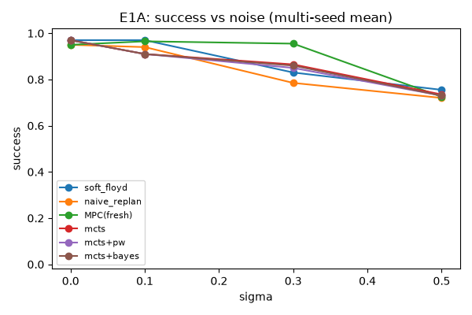
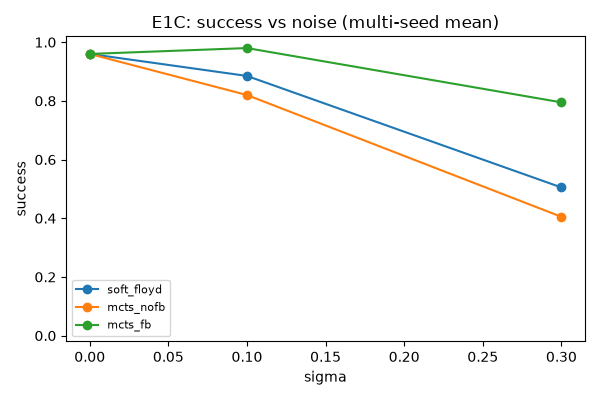
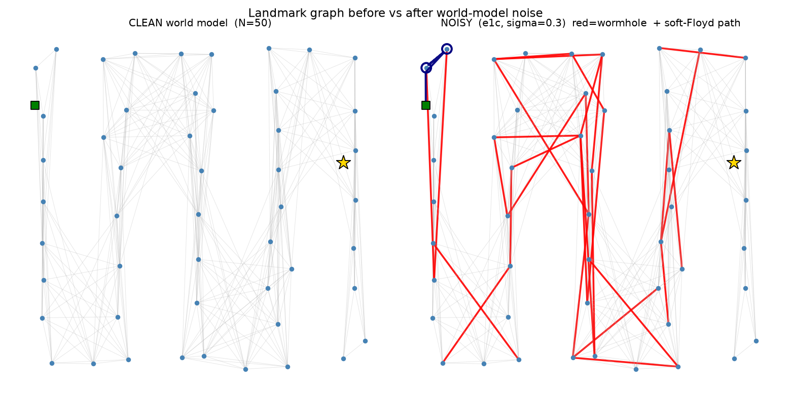
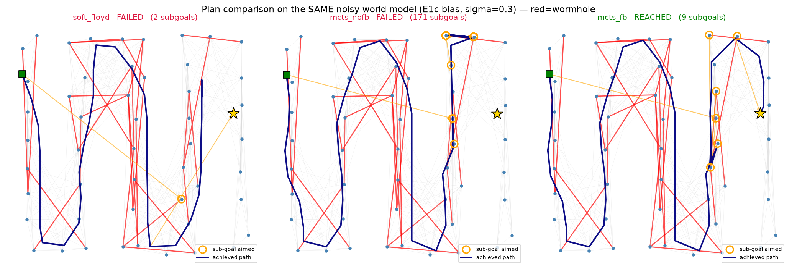
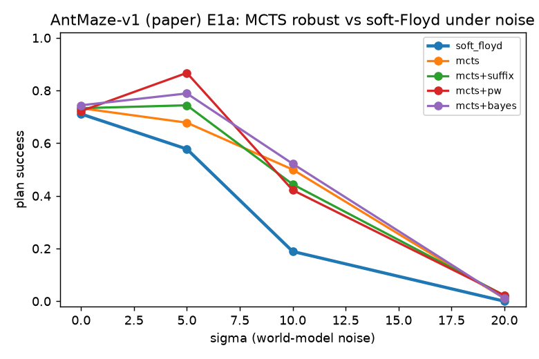
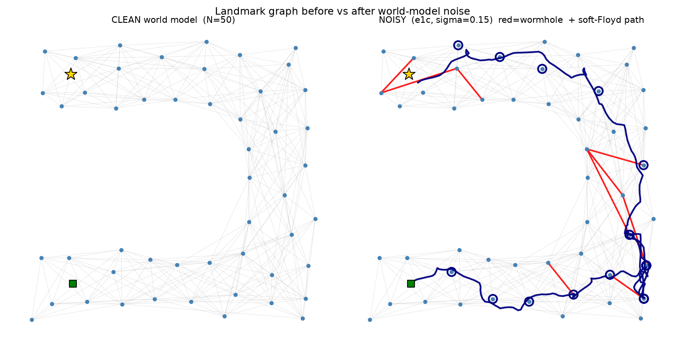
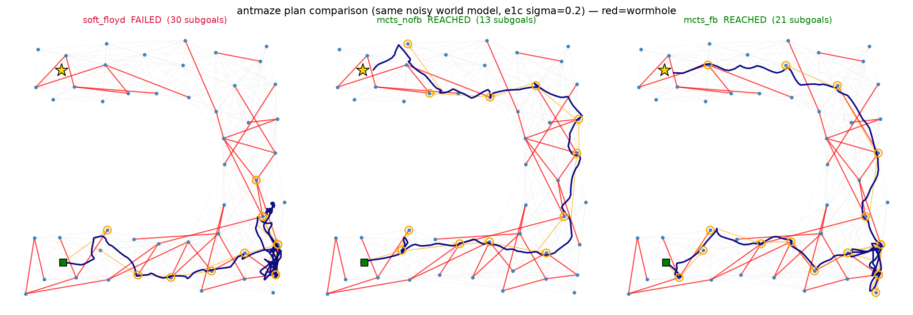
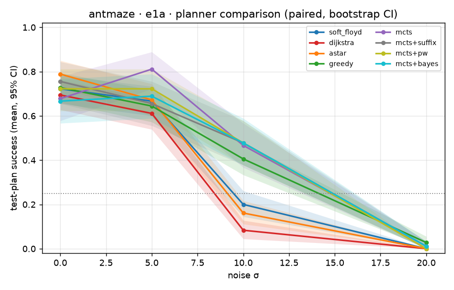
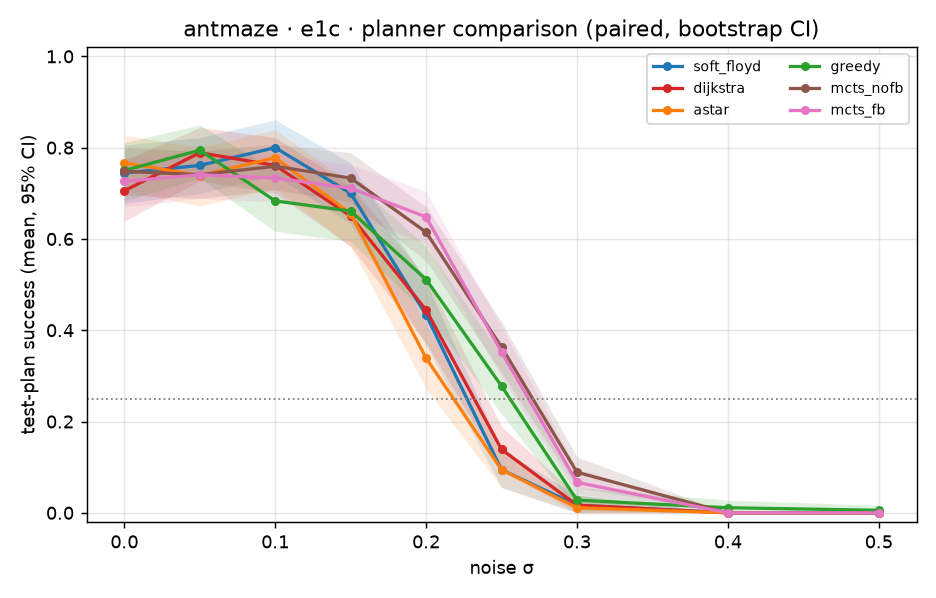

# MCTS-over-Landmarks: planning bền vững khi world-model bị nhiễu

> Mở rộng nghiên cứu cho **L³P** (*World Model as a Graph*, ICML 2021). Thay planner
> **Soft Floyd tất định** bằng **MCTS trên graph landmark**, rồi đo xem MCTS có ra quyết
> định **bền hơn khi ước lượng khoảng cách `V` bị nhiễu** hay không. Tài liệu này tổng hợp
> *phương pháp*, *kết quả đã xác thực*, và *lý giải thiết kế*. Spec gốc:
> [`docs/SPEC_MCTS_Landmark_L3P.md`](docs/SPEC_MCTS_Landmark_L3P.md).

> **Kết luận một dòng:** *soft-Floyd tốt + gần như miễn phí khi world-model chính xác;
> MCTS ăn tiền khi world-model NHIỄU + task LONG-HORIZON* — nhiễu stochastic thì
> **replan/sample-averaging** cứu, bias hệ thống thì **execution feedback** cứu — đổi
> lấy chi phí planning cao hơn (re-search mỗi macro-step).

## Nguồn số liệu (provenance) — mọi con số trong report truy được về đây

| Nhóm kết quả | Nơi chạy | File nguồn (đã xác thực) |
|---|---|---|
| **PointMaze reimpl, 4 training-seed, E1a+E1c** (canonical) | local | `logs/exp_suite/local/e1{a,c}_seed{0..3}_*.json` → pool bằng `scripts/aggregate_ablation.py` |
| **Fetch (paper stack, s967), E1a+E1c** | Kaggle | `logs/exp_suite/fetch_{e1a,e1c,plans_e1c}.json` (single-seed, point-estimate) |
| **AntMaze (paper stack), single-seed s221, E1a+E1c** | Kaggle | *reported* (raw per-episode log CHƯA sync về repo); trên đĩa chỉ có dump 1-episode: `logs/exp_suite/antmaze_{dump,plans}_e1c.json` |
| **Latency MCTS** (PointMaze N=50, 80 sims) | local | `logs/e1d_results.json` → `stats.mcts_seconds` |
| **E1b/E1d** (đã loại khỏi suite cuối) | local | `logs/e1_correctness_rerun_20260728/pointmaze_numpy/e1b_results.json`, `logs/e1d_results.json` |
| **E3 trap (CVaR)** — *preliminary* (§7.6) | local | `logs/exp_suite/e3{a,b}_results.json` (ckpt `l3p_pointmaze_trap.pt`) |
| **Planner comparison** (classical/soft-Floyd/MCTS, 3 env, E1a+E1c) — §7.7 | Kaggle | `logs/outputs/{antmaze,fetch,box_distractor}/…` (paired, per-episode; single **training**-seed) |

**Quy ước:** mọi bảng dưới đây là **mean [95% hierarchical-bootstrap CI]** trừ khi ghi
"reported" (AntMaze single-seed Kaggle — CHƯA có CItừ log gốc, cần multi-seed để firm). Ngoại lệ:
**§7.7** dùng **paired bootstrap CI** trên outcome per-episode (paired qua start/goal), single
training-seed — xem `docs/EXPERIMENTAL_DESIGN_planners.md`.

---

## 0. Tóm tắt kết quả

| Regime | Nhiễu | Cơ chế cứu | Kết quả (đã xác thực) |
|---|---|---|---|
| **E1a** | Loại-2 stochastic (resample mỗi lần) | sample-rollout + replan | **Phụ thuộc graph.** PointMaze (nhỏ, sạch-ish): MCTS ≈ soft-Floyd, **MPC-fresh bền nhất** (σ=0.3: 0.95). AntMaze (lớn, long-horizon): **MCTS >> soft-Floyd** (σ=10: 0.50 vs 0.19; +pw 0.87 @σ=5) — *reported*. |
| **E1c** | Loại-1 bias hệ thống (cố định/episode) | execution feedback | **Dương, mạnh nhất trên PointMaze:** σ=0.3 feedback **0.80 [0.70,0.89]** > Floyd 0.51 > no-fb 0.41 (4 seed, CI gần tách). AntMaze: fb ≥ Floyd ở mọi σ nhưng modest (+0.05–0.09, *reported*). |
| **Fetch** (control) | E1a & E1c | — | **Bão hoà trần** (short-horizon, goal reach ~13 bước / 0 subgoal): mọi planner ~1.0 tới σ=40 (E1a) / σ=0.3 (E1c) — negative control xác nhận planning không có đòn bẩy (§7.2). |

**Câu chuyện regime-dependent (đọc kỹ §7.6):** giá trị của tree-search KHÔNG tự hiện ra ở
mọi env — nó cần **(graph lớn hoặc/và horizon dài) + world-model nhiễu**. Ở PointMaze nhỏ,
"đắt nhất" thắng là **re-observe graph mỗi bước** (MPC-fresh), không phải tree-search. Ở
AntMaze lớn + nhiễu, MCTS mới tách rõ khỏi soft-Floyd tĩnh.

---

## 1. Vì sao mở rộng L³P

L³P học một **world-model dạng graph**: các *latent landmark* rải trên goal space, nối bằng
ước lượng reachability `V(g₁,g₂)` chưng cất từ Q-function. Planner của L³P là **Soft Floyd**
(Floyd–Warshall mềm) — tính đường ngắn nhất *một lần* đầu episode rồi commit.

**Điểm yếu L³P tự thừa nhận:** *"neural distance estimates are not entirely accurate"*.
Soft Floyd **tin `V` một cách tất định**: nếu một cạnh nhìn ngắn giả ("wormhole", L³P Fig. 6)
thì planner lao vào và **không có cơ chế sửa**.

> **Câu hỏi nghiên cứu:** khi `V` là ước lượng nhiễu, MCTS (explore/exploit qua UCB,
> sample-based rollout, uncertainty-aware, + execution feedback) có robust hơn Soft Floyd
> không? Nếu có, insight chuyển thẳng sang VLA (world-model học được cũng nhiễu y hệt).
>
> **Tiêu chí thành công:** hai đường `success vs σ` **tách nhau khi σ tăng** VÀ **trùng tại
> σ=0** (sanity bắt buộc).

---

## 2. Kiến trúc phân tầng — và vì sao giữ nguyên

Hệ thống có **2 tầng thời gian**. MCTS chỉ hoạt động ở **tầng cao (macro)**, chọn landmark
kế tiếp; việc đi giữa 2 landmark giao cho **low-level policy π** (học qua HER) — đây là
*temporal abstraction* của L³P.

```
HIGH-LEVEL (MCTS)  — "đi tới landmark nào tiếp?"  | rời rạc, N landmark (+goal)
      ↓ subgoal = f_D(landmark)
LOW-LEVEL (π, HER) — "đi thế nào?"                | action liên tục, 1 env.step
```

**Vì sao KHÔNG để MCTS plan từng action:** (1) quay lại đúng bài toán horizon-500 mà L³P né
được; (2) latent space được train để khoảng cách phản ánh reachability → 2 landmark liền kề
là điểm π *tin cậy đi được* (`d_max` cutoff đảm bảo); (3) chính vì π tự đi nên `V` chỉ là
*ước tính* — đây là nguồn uncertainty ta nghiên cứu.

---

## 3. MCTS-over-landmarks — phương pháp

Sau khi có `N` landmark, không gian search **hữu hạn** → UCT cổ điển áp dụng trực tiếp.
Code: [`l3p/planning/mcts_planner.py`](l3p/planning/mcts_planner.py).

| Pha | Làm gì | **Vì sao** |
|---|---|---|
| **Root** | Node gốc = state thật hiện tại; cạnh gốc = `d_{s→c}` từ critic `D` (sạch) | `D(s,π,c)` tính lại mỗi replan từ state thật → không cần nhiễu; chỉ **graph landmark-landmark** (ghép qua horizon dài) mới là nơi `V` nhiễu — đúng chỗ cần test. |
| **Selection (UCT)** | `argmax_j [ Q(node,j) + c·√(ln N/n_j) ]` | Cân bằng exploit (Q) và explore. Dấu nhất quán toàn codebase: "ít âm hơn = tốt hơn". |
| **Expansion** | Thêm landmark con chưa thử (trong tập *admissible*) | Có tùy chọn **progressive widening** (chỉ mở `k(n)=⌈c·nᵅ⌉` con) để không phải expand hết mới đào sâu — hữu ích khi N lớn (AntMaze). |
| **Simulation (rollout)** | Greedy theo heuristic `d_{c→g}` tới goal/hết horizon; **sample `V` mỗi lần dùng** | Rollout = "dynamics model" rẻ (1 forward MLP). Sample `V` mỗi lần = lập luận về **kỳ vọng** dưới transition stochastic (điều Soft Floyd bỏ qua). |
| **Backprop** | Cộng dồn chi phí (âm) lên đường đã đi; tùy chọn **suffix (return-to-go) backup** | Suffix backup credit đúng phần "còn lại tới goal" cho từng cạnh thay vì tổng thô. |
| **Chọn action cuối** | **Robust child** = max visit count (tie-break Q), KHÔNG chỉ max-Q | Tránh exploit một nhánh may nhờ noise; visit-count trung bình hoá nhiễu tốt hơn Q đơn lẻ. |

**Ba nâng cấp opt-in (bật qua config, mặc định tắt):** ① **suffix backup**, ② **progressive
widening**, ③ **uncertainty oracle-free** (normal-normal posterior / Thompson từ chính return
quan sát được, KHÔNG cần oracle σ). Ba cái này thay cho hướng oracle-σ cũ (E1b, §8).

**Bất biến quan trọng:** **`d_max` masking là thuộc tính CẤU TRÚC — quyết định 1 lần/episode,
KHÔNG resample.** Soft Floyd dùng softmax nên logit bị mask (`neg_inf`) tự tan; MCTS backup
**trung bình cộng** nên nếu để cạnh bị mask đóng góp chi phí cỡ `neg_inf` vào trung bình thì
nó nuốt tất cả. → tách "cạnh có tồn tại không" (mask tĩnh) khỏi "chi phí cạnh bao nhiêu"
(resample mỗi lần). Ở σ=0 MCTS khớp chính xác Soft Floyd.

---

## 4. Mô hình nhiễu — hai loại, hai năng lực khác nhau

Ước lượng `V` sai theo **hai bản chất khác nhau**, test **năng lực khác nhau**. Code:
[`l3p/planning/noise.py`](l3p/planning/noise.py).

| | **Loại 2 — execution stochasticity (E1a)** | **Loại 1 — estimation bias (E1c)** |
|---|---|---|
| Công thức | `V_obs = V_true + η`, `η~N(0,σ²)` **resample mỗi lần** | `V_obs = V_true·(1+b)`, `b~N(0,σ²)` **cố định 1 lần/episode** |
| Mô phỏng | π không tất định (cùng cặp, lần 20 bước lần 25) | world-model học SAI hệ thống vài cạnh ("wormhole") |
| MCTS thắng nhờ | **sample rollout / replan** → ước tính kỳ vọng đúng | **execution feedback** → phát hiện bias, sửa |
| Vì sao Soft Floyd thua | dùng điểm ước tính, bỏ qua variance | tin cạnh bias một lần, không sửa |

**Ba nơi `V` xuất hiện — chỉ tiêm nhiễu ở Nơi 1&2, giữ Nơi 3 sạch:**
```
Nơi 1: planner nhìn thấy (chọn đường)          → V_obs
Nơi 2: rollout bên trong MCTS (đánh giá đường) → V_sampled
Nơi 3: MÔI TRƯỜNG THẬT (agent đi mất bao nhiêu bước) → V_true  ← GIỮ SẠCH
```
**Vì sao giữ Nơi 3 sạch:** để **so sánh công bằng** — cả MCTS và Floyd bị "lừa" bởi cùng một
estimate nhiễu, nhưng success đo trên env thật. Khác biệt duy nhất là *cách xử lý* estimate
nhiễu, không phải env khác nhau.

---

## 5. Execution feedback (E1c) — chỗ MCTS *hơn về bản chất*

Dưới bias Loại-1, sample rollout vô dụng (bias cố định, trung bình hoá không cứu được). Cơ
chế thắng là **đi thử → đo chi phí thật → sửa**. Code: `FeedbackMCTSPlanner`.

1. **Snap-to-nearest:** gán state hiện tại về landmark gần nhất `i`.
2. **Đo realized cost:** `realized = k_used + max(0, −V(z_end, c_j))` (số bước env thật + phần
   dư), rồi **EMA**: `V_exec[i][j] ← (1−ρ)·prev + ρ·realized`.
3. **Rebuild `d_c2g` mỗi macro-step** với `V_exec` đã sửa → planner "học" trong episode.
4. **Loop guard:** blacklist cạnh thất bại quá `r_max` lần.

> **Vì sao đây là chỗ MCTS hơn Soft Floyd:** Soft Floyd tính path 1 lần, không sửa; MCTS
> **học từ execution thật** rồi điều chỉnh — đúng điểm yếu L³P tự thừa nhận.

**Substrate nhất quán:** feedback blend `realized_cost` (đơn vị
**bước env**) vào ước lượng cạnh. Nếu graph dựng trên `V` (thang khác, nén ~10×) mà không đổi
đơn vị thì EMA sai. → khi obs≡goal (PointMaze) dùng substrate **critic-`D`** (≈ số bước);
khi obs≠goal (Fetch/AntMaze) buộc dùng `V` và đo realized cost **cũng bằng `V`** (cờ
`_step_scale`) để không lệch đơn vị.

---

## 6. Giao thức công bằng — bắt buộc

- **`d_max` auto-calibrate mỗi run:** `d_max` mặc định 20 (từ AntMaze paper) **SAI** cho các
  checkpoint reimpl (scale `V`/`D` khác) → không cạnh nào bị mask → soft-Floyd không ghép được
  multi-hop → success 0.00 (dù flat policy ~0.9!). Sửa: quét `d_max`, chọn giá trị **tối đa hoá
  soft-Floyd sạch**, rồi **dùng chung cho MỌI nhánh** → không confound "MCTS thắng nhờ tune tốt
  hơn". (`calibrate_d_max`.)
- **Paired per-episode:** cùng `(σ, seed, episode)` → cả các nhánh thấy **cùng start/goal** và
  **cùng seed nhiễu**. Chỉ khác *thuật toán*.
- **Mean ± 95% hierarchical-bootstrap CI:** resample training-seed trước, rồi episode trong
  seed → giữ phương sai giữa seed (`hierarchical_bootstrap_ci`).
- **Sanity σ=0 bắt buộc:** không nhiễu → mọi nhánh phải trùng khít (điều kiện port đúng).

---

## 7. Kết quả (đã xác thực)

**Môi trường reimpl:** `PointMaze-Hard` (NumPy thuần), long-horizon test (start↔goal hai đầu,
horizon 500). **4 checkpoint** train độc lập (`l3p_pointmaze_full.pt` = seed0, `_seed{1,2,3}.pt`),
mỗi cái 500k bước, train-success 1.00. Config: γ=0.98, N=50 landmark, embedding=16, hidden
3×256 (Appendix-E). Đặc tính đo được: `V` nén (median ~1.5, max ~4.65), critic `D` median ~12
→ **D/V ≈ 10×** (lý do chọn substrate theo env, §5).

### 7.1 PointMaze reimpl — multi-seed (canonical)

Pool 4 training-seed × 2 eval-seed × 25 episode; CI = hierarchical bootstrap qua training-seed.
Tái tạo: `scripts/aggregate_ablation.py --dir logs/exp_suite/local --seeds 0 1 2 3 --regime e1{a,c}`.

**E1a (stochastic, Nơi 1&2, `d_max=0.68`, 100 sims):**



| σ | soft_floyd | naive_replan | **MPC(fresh)** | mcts | mcts+pw | mcts+bayes |
|---|---|---|---|---|---|---|
| 0.0 | 0.97 [0.92,1.00] | 0.95 [0.90,0.99] | 0.95 [0.90,0.99] | 0.97 [0.92,1.00] | 0.97 [0.91,1.00] | 0.97 [0.92,1.00] |
| 0.1 | 0.97 [0.91,1.00] | 0.94 [0.89,0.99] | 0.96 [0.92,1.00] | 0.91 [0.81,0.99] | 0.91 [0.81,0.99] | 0.91 [0.81,0.99] |
| **0.3** | 0.83 [0.51,1.00] | 0.79 [0.45,0.98] | **0.95 [0.90,0.99]** | 0.86 [0.70,1.00] | 0.85 [0.67,1.00] | 0.86 [0.70,1.00] |
| 0.5 | 0.76 [0.29,1.00] | 0.72 [0.28,0.98] | 0.72 [0.24,0.99] | 0.73 [0.30,1.00] | 0.73 [0.32,1.00] | 0.73 [0.29,1.00] |

**Đọc:** trên graph PointMaze nhỏ, **MPC-fresh** (re-observe toàn graph mỗi env-step) bền nhất
ở σ=0.3 (0.95) vì trung bình hoá temporal noise hiệu quả nhất. MCTS ≈ soft-Floyd (CI rộng,
chồng lấn) và **3 nâng cấp (pw/bayes) trung tính** — đúng kỳ vọng: đào sâu chỉ phát huy khi
graph lớn (xem AntMaze §7.3). MPC-fresh **không compute-matched** (rebuild graph tới 500 lần/ep)
→ chỉ kết luận được MCTS ≈ soft-Floyd tĩnh ở đây, không phải tốt nhất tuyệt đối.

**E1c (bias hệ thống, substrate critic-`D`, 80 sims, auto-τ = 0.25/0.5/1.0·d_max):**



| σ | soft_floyd (tĩnh) | mcts_nofb | **mcts_fb** |
|---|---|---|---|
| 0.0 | 0.96 [0.89,1.00] | 0.96 [0.89,1.00] | 0.96 [0.89,1.00] |
| 0.1 | 0.89 [0.81,0.95] | 0.82 [0.73,0.91] | **0.98 [0.94,1.00]** |
| **0.3** | 0.51 [0.37,0.64] | 0.41 [0.27,0.57] | **0.80 [0.70,0.89]** |

**Đọc:** dưới bias, **feedback thắng rõ** (σ=0.3: 0.80 vs Floyd 0.51, CI gần tách; no-fb 0.41
**tệ nhất** → phần thắng đến từ *feedback*, không phải lookahead). σ=0 là control tất định (3
nhánh = 0.96). **Robust với τ:** một run riêng với τ nới lỏng (2/3/4 bước, `logs/p1_multiseed/`)
cho fb ≈ **0.90 ± 0.03** ở σ=0.3 — cùng chiều, gap còn lớn hơn; kết quả không cherry-pick theo τ.

**Minh hoạ (σ=0.3 bias):**



Graph landmark trong maze chữ-W: panel nhiễu (phải) đầy cạnh **wormhole đỏ** cắt ngang tường; đường
soft-Floyd (navy) bị hút lên góc trên vào một wormhole.



Plan 3-planner cùng episode: **soft_floyd FAILED** (aim thẳng vào wormhole, 2 subgoal) / **mcts_nofb
FAILED** (thrash — 171 lần đổi subgoal) / **mcts_fb REACHED** (9 subgoal). Chiến thắng đến từ feedback.

### 7.2 Fetch (paper stack) — negative control: planning không có đòn bẩy

> **Provenance:** chạy trên **stack paper**, checkpoint **FetchPickAndPlace-v1 s967** (train đủ,
> plan-success ~1.0) qua `repro/paper_mcts/`. Single-seed, point-estimate (mean qua ~90 episode,
> chưa CI). Nguồn trên đĩa: `logs/exp_suite/fetch_{e1a,e1c,plans_e1c}.json`.

Fetch là **short-horizon manipulation**: dump 1-episode (σ=0.2) cho thấy cả 3 planner chạm goal
trong **13 bước với 0 subgoal** — reach goal trực tiếp, **không route qua landmark nào** → planning
gần như **không có đòn bẩy**.


Graph landmark (object x–y, N=80): dù nhiễu tạo cạnh **wormhole đỏ**, start (ô vuông xanh) nằm ngay
cạnh goal (sao vàng) nên đường soft-Floyd (navy) rất ngắn.


Hình plan (σ=0.2 bias): start (ô vuông xanh) nằm **ngay cạnh** goal (sao vàng) trong không gian
object x–y; dù nhiễu tạo cạnh **wormhole** (đỏ), cả `soft_floyd`/`mcts_nofb`/`mcts_fb` đều REACHED
với **0 subgoal** — không planner nào bị bẫy vì goal ở trong tầm với trực tiếp.

**E1a (stochastic, 100 sims)** — mọi planner giữ **~1.0 tới tận σ=40**:

| σ | soft_floyd | mcts | +suffix | +pw | +bayes |
|---|---|---|---|---|---|
| 0 | 1.00 | 0.99 | 0.98 | 0.99 | 1.00 |
| 5 | 0.98 | 1.00 | 1.00 | 0.99 | 1.00 |
| 10 | 1.00 | 1.00 | 1.00 | 1.00 | 0.99 |
| 20 | 1.00 | 0.99 | 0.99 | 1.00 | 0.99 |
| 40 | 0.97 | 0.98 | 0.99 | 1.00 | 0.97 |

**E1c (bias, 100 sims)** — tương tự, **~1.0 tới σ=0.3**:

| σ | soft_floyd | mcts_nofb | mcts_fb |
|---|---|---|---|
| 0.0 | 1.00 | 1.00 | 0.99 |
| 0.1 | 1.00 | 0.99 | 1.00 |
| 0.2 | 1.00 | 1.00 | 0.99 |
| 0.3 | 1.00 | 1.00 | 0.99 |

**Chốt Fetch:** đây là **negative control đúng như dự đoán** — task short-horizon, goal reach trực
tiếp (0 subgoal) → nhiễu world-model **không** phá được planning vì gần như không có planning để phá.
Mọi planner bão hoà trần, không tách được — và đó chính là điều nên thấy. Khẳng định câu chuyện
regime-dependent: **MCTS chỉ ăn tiền khi planning load-bearing (long-horizon, §7.1/§7.3)**.

### 7.3 AntMaze (paper stack, Route A) — *single-seed, reported*

> **Provenance:** các bảng dưới đây chạy trên **stack paper 2019 (Kaggle)**, checkpoint
> paper-faithful **AntMaze-v1 seed 221** (test-plan ~0.8 >> HER ~0.58 — long-horizon, planner
> load-bearing). Đây là **single-seed**, và **raw per-episode log CHƯA sync về repo** → chưa có
> CI. Trên đĩa chỉ có dump 1-episode để verify chiều (dưới). Cần multi-seed để firm.

**E1a (stochastic, 100 sims) — MCTS sample-averaging thắng đậm:**



| σ | soft_floyd | mcts | +pw | +bayes |
|---|---|---|---|---|
| 0 | 0.71 | 0.73 | 0.72 | 0.74 |
| 5 | 0.58 | 0.68 | **0.87** | 0.79 |
| 10 | **0.19** | **0.50** | 0.42 | 0.52 |

→ Dưới nhiễu, **MCTS >> soft-Floyd** (σ=10: 0.50 vs 0.19); **+pw thắng đậm ở σ=5** (0.87) — graph
lớn (N≈200 sau extra-landmark), đào sâu phát huy (ngược PointMaze nhỏ nơi pw trung tính).

**E1c (bias, fine sweep) — feedback cứu nhưng modest:**

| σ | soft_floyd | mcts_nofb | mcts_fb |
|---|---|---|---|
| 0 | 0.77 | 0.79 | 0.82 |
| 0.05 | 0.74 | 0.77 | **0.81** |
| 0.10 | 0.69 | 0.70 | **0.76** |
| 0.15 | 0.67 | 0.72 | **0.74** |
| 0.20 | 0.49 | 0.74* | 0.56 |

→ **mcts_fb ≥ soft_floyd ở mọi σ** (+0.05–0.09). **Cơ chế KHÁC theo env:** PointMaze thắng thuần
do *feedback* (nofb tệ hơn Floyd); AntMaze **replan/lookahead gánh chính** (nofb cũng > Floyd),
feedback thêm chút. *(σ=0.2 nofb=0.74 tăng phi lý → nghi variance 1-seed.)*

**Corroboration trên đĩa** (`logs/exp_suite/antmaze_plans_e1c.json`, σ=0.2, **1 episode**): soft_floyd
**FAIL** (30 subgoal, chạm trần 501 bước) trong khi **mcts_nofb & mcts_fb REACHED** (14/22 subgoal,
221/291 bước) — nhất quán chiều với bảng E1c.

**Minh hoạ:**



Graph trong U-maze (σ=0.15): vùng trống giữa-trái là **tường**; cạnh **wormhole đỏ** = "teleport"
giả cắt ngang tường — bẫy soft-Floyd tin.



Plan 3-planner (σ=0.2): **soft_floyd FAILED** (kẹt góc dưới-phải, thrash) / **mcts_nofb & mcts_fb
REACHED** — đi trọn vòng U từ start (dưới-trái) lên phải, qua đỉnh, tới goal (sao trên-trái).

### 7.4 Chi phí / độ phức tạp planning

**Asymptotic (từ thuật toán):** soft-Floyd `O(soft_iters·N³)` — plan **1 lần/episode**; MCTS
`O(n_sim·H·N)` — re-search **mỗi macro-step**. → MCTS đắt hơn nhiều bậc và **nổ theo N**.

**Đo được:**
- **PointMaze N=50, 80 sims** (`logs/e1d_results.json`, σ=0.3, search-time/episode): mcts_nofb
  ≈ **0.40 s/ep**, mcts_fb ≈ **0.24 s/ep** (early-stop-on-success làm fb nhanh hơn); soft_floyd ≈ 0.
- **Fetch N=80, 100 sims** (`logs/exp_suite/fetch_e1{a,c}.json`, ms/search): MCTS ≈ **28–82 ms/search**
  (E1a), **~21–31 ms/search** (E1c); soft_floyd ≈ 0 (plan 1 lần).

Chi phí MCTS tăng tuyến tính theo `n_sim`, `H`, và `N` (mỗi sim quét cạnh admissible); soft-Floyd
plan **một lần/episode** nên ~miễn phí. Đây là cái giá để đổi lấy robustness dưới nhiễu (§7.1/§7.3).

### 7.5 Chú thích hình & script

Hình graph clean-vs-noisy + plan 3-planner của **cả ba env** đã nhúng inline ở §7.1 (PointMaze),
§7.2 (Fetch), §7.3 (AntMaze). Quy ước chung: cạnh **đỏ = wormhole** (nhiễu làm ngắn giả), đường
navy = trajectory thật, ô vuông xanh = start, sao vàng = goal, vòng cam = subgoal được aim.

- `viz_graph_noise.py` → hình graph (`viz_{env}_e1c.png`); `viz_plans.py` → hình plan (`plans_{env}_e1c.png`).
- Summary curve success-vs-σ: `summary_{e1a,e1c}.png` (PointMaze, có CI), `summary_antmaze*.png`.

### 7.6 E3 — Trap deceptive-irreversible (risk-sensitive CVaR) — *preliminary*

> **Hướng mở rộng CHÍNH** (spec §4.6 + `docs/REPORT_MCTS_Landmark_Trap.md`). Khác E1 (nhiễu ước
> lượng): trap là vùng **bất khả hồi** mà planner tối-ưu-trung-bình (Floyd **và** MCTS-mean) **mù
> về mặt thông tin** — Report §2.6 chứng minh rủi ro sống ở *moment ≥2 của landing distribution*,
> không có trong `V`; nên softmax-Floyd cũng không cứu được. **MCTS backup risk-sensitive (CVaR)**
> nhìn đuôi phân phối → né. **Trạng thái: preliminary** (engine proven; demo env còn modest).

**Setup:** env `PointMazeTrap` — ring "vật cản giữa": arc ngắn (14 hop, qua trap-pocket) vs arc dài
(26 hop, an toàn); đi thẳng bị tường chặn ⇒ planning **load-bearing** (flat-policy = 0.00). Checkpoint
train **trap-OFF** (`checkpoint/l3p_pointmaze_trap.pt`) → `V`/landmark không "biết" trap (đúng tính
deceptive). Planner giữ **hop-by-hop** (root-mask theo d_max) để trap được model ở từng macro-step;
CVaR tính cả trong UCT (ổn định) + spill-seed cố định/episode (chống thrashing). Nhánh: `soft_floyd`
(LatentPlanner, L³P), `mcts_mean` (CVaR α=1), `mcts_cvar` (α<1). Nguồn: `logs/exp_suite/e3{a,b}_results.json`.

**Chứng minh ENGINE (chắc chắn, tất định):** `tests/test_modules.py::test_cvar_robust_child_avoids_spill_trap`
— cho CÙNG landing/spill-model, mean/Floyd chọn landmark-danger, CVaR chọn landmark-safe.

**E3a — sweep p_spill (α=0.3, r_absorb=−30), mean [95% CI], 4 seed × 15 ep:**


| p_spill | trap-hit: floyd / mean / **cvar** | success: floyd / mean / **cvar** |
|---|---|---|
| 0.0 | 0.00 / 0.00 / 0.00 | 1.00 / 1.00 / 1.00 |
| 0.1 | 0.13 / 0.13 / 0.13 | 0.87 / 0.87 / 0.65 |
| 0.2 | 0.22 / 0.18 / **0.12** | 0.78 / 0.77 / 0.40 |
| 0.3 | 0.23 / 0.22 / **0.15** | 0.77 / 0.70 / 0.32 |

**E3b — sweep α @ p_spill=0.3 (α-curve, kết quả chính §4.6), 4 seed × 15 ep:**


| α | cvar trap-hit | cvar success |
|---|---|---|
| **1.0** (≡ mean) | 0.22 [0.10,0.35] | 0.70 [0.55,0.85] |
| 0.5 | 0.17 [0.05,0.28] | 0.63 [0.50,0.77] |
| 0.3 | 0.15 [0.05,0.28] | 0.32 [0.18,0.47] |
| 0.1 | 0.03 [0.00,0.10] | 0.13 [0.02,0.28] |

**Đọc:** (i) **sanity ✓** — p_spill=0 mọi nhánh tie (1.00); α=1 ⇒ CVaR ≡ mean (0.22/0.70). (ii)
**α-curve khớp lý thuyết §4.6:** giảm α → trap-hit giảm đơn điệu (0.22→0.03) **đổi lấy** success
(0.70→0.13); α→0 = **paralysis** đúng như dự đoán. (iii) `cvar` giảm trap-hit **đúng chiều ở mọi
p_spill** so với mean/Floyd.

**⚠️ Hạn chế (trung thực):**
- **Magnitude modest + CI chồng** — α=0.3 @σ=0.3: cvar trap 0.15[0.05,0.28] vs mean 0.22[0.08,0.35]
  chưa tách thống kê (4 seed × 15 ep chưa đủ).
- **Success cost nặng:** né trap ⇒ đi arc-an-toàn dài 26 hop, low-level point-mass hay timeout →
  success tụt (α=0.3: 0.32). Không có α nào vừa trap≈0 vừa success cao trên env nhỏ này.
- **Gốc rễ:** point-mass PointMaze **margin-planning mỏng** (đúng kết luận E1) → route-control nhiễu.
  **Demo sạch/mạnh cần env load-bearing thật (AntMaze locomotion)** — hướng vòng sau.

**Chốt E3:** cơ chế CVaR **đúng về nguyên lý (engine proven) + đúng chiều & khớp lý thuyết trên env
(α-curve trade-off, paralysis)**; nhưng demo end-to-end trên PointMaze **modest, chưa significant**
do env thiếu đòn bẩy + arc-safe khó.

### 7.7 So sánh planner: cổ điển (Dijkstra / A* / greedy) vs soft-Floyd vs MCTS

> **Câu hỏi:** trên cùng graph nhiễu, *thuật toán định tuyến* ảnh hưởng robustness thế nào, và
> **bơm nhiễu tới đâu thì mọi planner fail?** Thêm 3 baseline định-tuyến cổ điển (Dijkstra hard
> shortest-path, A*, greedy myopic) chạy trên **cùng** noisy landmark graph với soft-Floyd/MCTS.
> Giao thức paper-grade: **paired** (mọi planner cùng start/goal mỗi episode), **paired bootstrap
> 95% CI** trên outcome per-episode, classical 180 rollouts / MCTS-band 270 (3 noise-seed).
> Thiết kế đầy đủ: [`docs/EXPERIMENTAL_DESIGN_planners.md`](docs/EXPERIMENTAL_DESIGN_planners.md).
> Provenance: `logs/outputs/{antmaze,fetch,box_distractor}/…` (paper stack, single **training**-seed).

**Bảng đầu (headline) — σ_all_fail & σ\* (gap MCTS−Floyd có ý nghĩa: CI tách 0):**

| Env · regime | σ_all_fail | σ\* | gap tại σ\* (best-MCTS − soft_floyd) | planner tệ nhất tại σ\* |
|---|---|---|---|---|
| **AntMaze · E1c** (bias) | **0.30** | 0.25 | **+0.252 [+0.185, +0.319]** | astar/soft_floyd/dijkstra ~0.09–0.14 |
| **AntMaze · E1a** (stochastic) | **20** | 10 | **+0.313 [+0.189, +0.444]** | **dijkstra 0.08** |
| **Fetch** (control) | không sập | — | none significant | — |
| **BoxDistractor** | không sập (sàn ~0.5) | 0 (planning-quality) | +0.13 [+0.06,+0.21] @σ=0 | greedy |

**AntMaze E1a (stochastic) — mean [95% CI]:**



| σ | soft_floyd | dijkstra | astar | greedy | mcts | +pw | +bayes |
|---|---|---|---|---|---|---|---|
| 0 | 0.72 | 0.69 | 0.79 | 0.73 | 0.68 | 0.72 | 0.67 |
| 5 | 0.67 | 0.61 | 0.67 | 0.64 | **0.81** | 0.72 | 0.69 |
| **10** | 0.20 [.14,.26] | **0.08 [.04,.13]** | 0.16 [.11,.22] | 0.41 [.33,.48] | **0.47 [.37,.57]** | 0.48 [.38,.58] | **0.48 [.38,.59]** |
| 20 | 0.00 | 0.00 | 0.00 | 0.03 | 0.01 | 0.00 | 0.01 |

**AntMaze E1c (bias) — mean [95% CI]:**



| σ | soft_floyd | dijkstra | astar | greedy | mcts_nofb | mcts_fb |
|---|---|---|---|---|---|---|
| 0 | 0.74 [.68,.81] | 0.71 [.64,.77] | 0.77 [.71,.83] | 0.75 [.68,.81] | 0.75 [.70,.80] | 0.73 [.67,.78] |
| 0.10 | 0.80 [.74,.86] | 0.76 [.70,.82] | 0.78 [.71,.84] | 0.68 [.62,.75] | 0.76 [.71,.81] | 0.73 [.68,.79] |
| 0.15 | 0.70 [.63,.77] | 0.65 [.58,.72] | 0.66 [.58,.72] | 0.66 [.59,.73] | 0.73 [.68,.79] | 0.71 [.66,.76] |
| **0.20** | 0.43 [.37,.51] | 0.44 [.37,.52] | 0.34 [.27,.41] | 0.51 [.44,.58] | 0.61 [.55,.67] | **0.65 [.59,.70]** |
| **0.25** | 0.09 [.06,.14] | 0.14 [.09,.19] | 0.09 [.06,.14] | 0.28 [.22,.34] | **0.36 [.31,.42]** | 0.35 [.30,.41] |
| 0.30 | 0.02 | 0.02 | 0.01 | 0.03 | 0.09 [.06,.12] | 0.07 [.04,.10] |

*(σ=0.4/0.5: mọi planner ≈ 0.)*

**Phát hiện chính — thứ tự gục đúng cơ chế** (rõ nhất tại E1a σ=10):
**Dijkstra 0.08 < A* 0.16 < soft_floyd 0.20 < greedy 0.41 < MCTS ~0.48.** Hard shortest-path
(Dijkstra/A*) **commit một đường cứng → bị "wormhole" nhiễu dụ nặng nhất**; soft-Floyd (soft
aggregation) đỡ hơn; **greedy myopic vô tình robust** (không đuổi wormhole xa); **MCTS bền nhất**
(sample rollout né đuôi). Đây chính là spread giải thích *vì sao* L³P chọn soft-Floyd và vì sao
tree-search thắng. Ở E1c, MCTS trụ tới σ=0.25 (~0.35) khi Floyd/Dijkstra/A* đã sập (~0.09–0.14).

**Fetch (negative control):** mọi planner ~0.95–1.0 tới σ=40 (E1a) / 0.5 (E1c), **không sập** —
short-horizon, planning không đòn bẩy (greedy tụt nhẹ ~0.82–0.89 ở σ cao). Xác nhận: nhiễu không
phá được thứ không có để phá.

**BoxDistractor (manip):** **không sập** (sàn ~0.5 tới σ tối đa) và ngay tại σ=0 **Dijkstra/A*/MCTS
0.76–0.80 > soft_floyd 0.68 > greedy 0.57** → đây là câu chuyện *chất lượng planning*, không phải
*robustness-to-noise*; discriminator yếu cho trục nhiễu → **AntMaze là env chủ lực**.

**⚠️ Hạn chế (trung thực):**
- **A\* ≠ Dijkstra chính xác** (E1a σ=0: A* 0.79 vs Dijkstra 0.69). Heuristic soft-VI **không
  admissible tuyệt đối** sau clipping của paper → A* chọn route hơi khác — nó là một planner
  heuristic riêng, **không** phải "bản latency-twin" của Dijkstra. (Cross-check `astar==dijkstra`
  chỉ đúng khi heuristic admissible.)
- **Single TRAINING-seed** mỗi env (s221/s829/s967). Paired + noise-band khống chế phương sai
  *nhiễu*, KHÔNG phải phương sai *training-seed* → cần 2–3 training-seed để firm hẳn
  (`repro/kaggle_notebooks/antmaze_train.ipynb` train 252/173).
- σ=0 các planner chỉ *xấp xỉ* nhau (thuật toán khác trên graph sạch) — trong khoảng CI.
- σ **inject** (không phải nhiễu tự nhiên của một world-model học thật).

Tái lập: `python scripts/plot_planners.py --json <env>_<regime>_classical.json <env>_<regime>_mcts.json --out …png`
(paired bootstrap CI + knee/collapse/σ\*). Sweep: `repro/kaggle_notebooks/{antmaze_classical,antmaze_mcts,fetch_ablation,boxdistractor_ablation}.ipynb` (`--planners`, `--noise-seeds`).

---

## 8. Điều đã loại khỏi suite cuối — và vì sao

- **E1b (uncertainty bonus với oracle σ):** cho MCTS biết chính xác σ mỗi cạnh — **không thực tế**.
  Kết quả cũng yếu: α (né-rủi-ro-trong-reward) chỉ +0.08 @σ_hi=0.5 (0.27 vs none 0.19), **CI chồng**;
  @σ_hi=1.0 cả ba về sàn 0.03; β (bonus-trong-UCT) **không lợi ích** (β chỉ áp ở node sâu, không đổi
  giá trị backup lên root → không đổi được macro-step đầu). → **Thay bằng ③ bayes/thompson
  oracle-free** (§3). Nguồn: `logs/e1_correctness_rerun_20260728/pointmaze_numpy/e1b_results.json`.
- **E1d (composite: nhiễu ở planner+rollout+execution):** ở σ=0.3 **mọi nhánh gần trần**
  (fb 1.00 ≥ nofb 0.97 ≥ Floyd 0.90) → không đủ sức phân giải các planner. Nguồn:
  `logs/e1d_results.json`.
- **Old single-checkpoint E1a/E1c** (`e1_correctness_rerun_20260728/`): **superseded** bởi multi-seed
  §7.1 (chạy trên cả 4 checkpoint thay vì 1).

---

## 9. Hạn chế (trung thực)

- **AntMaze single-seed, log gốc chưa sync:** kết quả dương mạnh nhất (E1a MCTS>>Floyd) hiện chỉ
  *reported* từ Kaggle 1 seed; cần **multi-seed + CI** (train thêm seed 252/173) mới firm.
- **PointMaze là env dễ** (flat policy ~0.9) → margin planning mỏng; giá trị MCTS chỉ hiện ở graph
  lớn/nhiễu (AntMaze) → phụ thuộc vào việc mở rộng sang env khó của paper.
- **Fetch bão hoà trần** (short-horizon, planning không đòn bẩy) → là negative control tốt nhưng
  không phân biệt được planner; cần env manip **long-horizon** để test MCTS bên manipulation
  (BoxDistractor — notebook train đã sẵn sàng).
- **MPC-fresh chưa compute-matched:** E1a PointMaze chưa log số model-query/latency cho baseline
  rebuild-mỗi-bước để so công bằng với MCTS.
- **σ do ta inject**, không phải nhiễu tự nhiên của một world-model học thật.
- **Hyperparameter phần lớn chưa quét** (ρ=0.5, r_max=2, pw c/α, bayes σ₀/n₀ đặt theo lý lẽ).

---

## 10. Tái lập

```bash
python tests/test_modules.py                         # unit + regression (suffix backup, pw, bayes/thompson)

# PointMaze reimpl, multi-seed (canonical) — chạy từng checkpoint rồi pool:
python scripts/run_e1a.py --load checkpoint/l3p_pointmaze_full.pt --seeds 0 1 --episodes 25 --sigmas 0 0.1 0.3 0.5
python scripts/run_e1a.py --load checkpoint/l3p_pointmaze_full.pt --pw            # + progressive widening
python scripts/run_e1a.py --load checkpoint/l3p_pointmaze_full.pt --uncertainty-mode bayes
python scripts/run_e1c.py --load checkpoint/l3p_pointmaze_full.pt --seeds 0 1 --episodes 25 --sigmas 0 0.1 0.3
#   ... lặp cho _seed{1,2,3}.pt, đặt vào logs/exp_suite/local/, rồi:
python scripts/aggregate_ablation.py --dir logs/exp_suite/local --seeds 0 1 2 3 --regime e1a
python scripts/aggregate_ablation.py --dir logs/exp_suite/local --seeds 0 1 2 3 --regime e1c

# E3 trap (CVaR) — train the fork-maze checkpoint (trap OFF), then sweep:
python scripts/train_pointmaze.py --env PointMazeTrap --steps 250000 --n-landmarks 40 \
    --batch-size 256 --n-grad-steps 20 --warmup 150 --hindsight 12 --save checkpoint/l3p_pointmaze_trap.pt
python scripts/run_e3.py --mode e3a --p-spill 0 0.1 0.2 0.3 --alpha 0.3 --r-absorb -30 --d-max 2.5 --seeds 0 1 2 3
python scripts/run_e3.py --mode e3b --p-spill 0.3 --alpha 1.0 0.5 0.3 0.1 --r-absorb -30 --d-max 2.5 --seeds 0 1 2 3

# Paper env (Kaggle, stack 2019) — Fetch/AntMaze/BoxDistractor; xem
# repro/kaggle_notebooks/{antmaze,fetch,boxdistractor}_ablation.ipynb. Ví dụ Fetch:
#   eval_ablation.py --env fetch --regime e1a --latency --out logs/exp_suite/fetch_e1a.json
#   eval_ablation.py --env fetch --regime e1c --out logs/exp_suite/fetch_e1c.json --dump-plans logs/exp_suite/fetch_plans_e1c.json

# Hình minh hoạ:
python scripts/viz_graph_noise.py --load checkpoint/l3p_pointmaze_full.pt --regime e1c --sigma 0.3 --traj --out logs/exp_suite/viz_pointmaze_e1c.png
python scripts/viz_plans.py       --load checkpoint/l3p_pointmaze_full.pt --sigma 0.3 --out logs/exp_suite/plans_pointmaze_e1c.png
python scripts/viz_graph_noise.py --from-dump logs/exp_suite/antmaze_dump_e1c.json  --out logs/exp_suite/viz_antmaze_e1c.png
python scripts/viz_plans.py       --from-dump logs/exp_suite/antmaze_plans_e1c.json --out logs/exp_suite/plans_antmaze_e1c.png
```

---

## 11. Bản đồ code

| File | Vai trò |
|---|---|
| `l3p/planning/mcts_planner.py` | `LandmarkMCTS` (UCT/rollout/backprop + suffix backup + progressive widening + bayes/thompson + **CVaR backup + trap-in-rollout**, E3), `MCTSPlanner`, `FeedbackMCTSPlanner` + `SoftFloydE1c` (E1c), **`TrapMCTSPlanner`** (E3: CVaR + hop-by-hop + spill model) |
| `l3p/planning/noise.py` | `NoisyValueFn` (E1a), `BiasedValueFn`+`build_bias_matrix`+`CriticEdgeFn` (E1c), `dmax_candidates`, `hierarchical_bootstrap_ci`, `ValueOverrideAgent` |
| `l3p/planning/baselines.py` | `NaiveReplanPlanner`, `FreshGraphReplanPlanner` (MPC-fresh) |
| `l3p/planning/graph_search.py` | Soft Floyd + `reachable_to_goal`/`is_trap` (E3 reach-set collapse, self-supervised) |
| `l3p/envs/point_maze_trap.py` | `PointMazeTrapEnv` (E3 fork/obstacle maze + absorbing trap + `p_spill` landing) |
| `l3p/planning/{planner}.py` | Algorithm 1 gốc (KHÔNG sửa) |
| `scripts/run_e1{a,c}.py`, `scripts/run_e3.py` | Harness reimpl E1 + **E3** (trap sweep p_spill/α, trap-hit/success + CI + plot) |
| `scripts/aggregate_ablation.py` | Pool multi-seed JSON → bảng master + CI + curve |
| `scripts/plot_planners.py` | **(§7.7)** overlay success-vs-σ mọi planner từ JSON paper; **paired bootstrap 95% CI** + knee/collapse/σ\* tự động |
| `scripts/viz_{graph_noise,plans}.py` | Hình clean-vs-noisy graph + plan 3-planner |
| `repro/paper_mcts/pathfind.py` | **(§7.7)** planner cổ điển pure-numpy: `hard_cost_to_goal`(Dijkstra), `astar_first_hop`, `greedy_first_hop` — unit-test `test_pathfind.py` vs Floyd/brute-force |
| `repro/paper_mcts/` | Port MCTS vào repo paper (`PaperMCTSPlanner` + `_dijkstra/_astar/_greedy_select`; `eval_ablation.py` với `PLANNER_REGISTRY`/`--planners`/`--noise-seeds`/paired `--pair-seed` + per-episode log) |
| `repro/kaggle_notebooks/` | Notebook train + ablation: `antmaze_{classical,mcts,train}`, `fetch_ablation`, `boxdistractor_{ablation,train}` |
| `tests/test_modules.py` | Unit + regression cho mọi thành phần mới |
