# L³P Reproduction Report — *World Model as a Graph: Learning Latent Landmarks for Planning*

Tái hiện thuật toán L³P (Zhang, Yang & Stadie, ICML 2021) bằng PyTorch, chạy trên
các môi trường MuJoCo thật của paper (gymnasium-robotics) và một môi trường
PointMaze thuần NumPy.

---

## 1. Thuật toán & mã nguồn

L³P học một **world model dạng đồ thị**: các *node* là tập nhỏ latent landmark rải
khắp goal-space theo độ với-tới-được (reachability); các *edge* là ước lượng khoảng
cách chưng cất từ Q-function. Lập kế hoạch = graph search trên đồ thị + một online
planner tận dụng trừu tượng thời gian.

Mỗi thành phần trong mã nguồn ánh xạ trực tiếp với phương trình của paper:

| Thành phần | File | Paper |
|---|---|---|
| Critic tham số hóa theo khoảng cách `Q=−(1−γ^D)/(1−γ)` | `l3p/models/networks.py` | Eq. 3 |
| TD-loss cho Q (HER) | `l3p/agent/ddpg.py:update_critic` | Eq. 1 |
| Value `V(g₁,g₂)` hồi quy về D | `l3p/agent/ddpg.py:update_value` | Eq. 4 |
| Actor (max Q + action-L2) | `l3p/agent/ddpg.py:update_actor` | §4 |
| Auto-encoder + ràng buộc reachability | `l3p/models/autoencoder.py`, `l3p/losses.py` | Eq. 2 |
| Latent landmark (MoG + ELBO) | `l3p/models/landmarks.py` | Eq. 5 |
| Greedy Latent Sparsification | `l3p/models/landmarks.py` | Algorithm 2 |
| Soft-Floyd graph search + `d_max` | `l3p/planning/graph_search.py` | Eq. 6, 8 |
| Online planner (chọn subgoal, cam kết K bước) | `l3p/planning/planner.py` | Algorithm 1, Eq. 7 |
| HER (relabelling + hindsight range) | `l3p/replay/her_buffer.py` | §3, App. D |
| Vòng huấn luyện tổng | `l3p/trainer.py` | Algorithm 3 |
| Siêu tham số | `l3p/config.py` | Appendix E |

Huấn luyện theo Algorithm 3: mỗi vòng thu thập episode (có/không planning) vào một
**replay tập trung**, rồi cập nhật đồng thời 5 module (Q, V, AE, centroid, policy).

---

## 2. Môi trường (6 bộ)

| Env | Backend | obs/goal/act | Nguồn |
|---|---|---|---|
| PointMaze (NumPy) | thuần NumPy | 2/2/2 | `l3p/envs/point_maze.py` |
| PointMaze (MuJoCo) | gymnasium-robotics | 4/2/2 | `PointMaze_Large-v3` |
| FetchPickAndPlace | gymnasium-robotics | 25/3/4 | `FetchPickAndPlace-v4` |
| Box-Distractor-PickAndPlace | gymnasium-robotics + XML tùy chỉnh | 25/3/4 | `l3p/envs/fetch_variants.py` |
| Place-Inside-Box | gymnasium-robotics + XML tùy chỉnh | 25/3/4 | `l3p/envs/fetch_variants.py` |
| AntMaze | gymnasium-robotics | 105/2/8 | `AntMaze_Medium-v5` |

Hai biến thể Fetch (box distractor, đặt-trong-hộp với curriculum 80/20) được dựng
bằng cách sinh XML MuJoCo = cảnh Fetch gốc + thêm body box, rồi subclass
`MujocoFetchEnv`. Toàn bộ thuật toán L³P **không đổi** giữa các môi trường — chỉ có
lớp env thay đổi.

---

## 3. Thiết kế thực nghiệm

**Vòng huấn luyện (off-policy, Algorithm 3, `l3p/trainer.py`).** Lặp hai pha:

- **(A) Thu thập (`collect`).** Mỗi worker chạy trọn một episode `T` bước; action lấy
  từ: random (warm-up) / planner (50% episode, `search_prob_train`) / policy thuần.
  Toàn bộ episode (obs, achieved_goal, desired_goal, action) được lưu vào **HER replay
  buffer tập trung**. Sau đủ warm-up → GLS khởi tạo latent landmark.
- **(B) Cập nhật (`update`).** Mỗi bước gradient: lấy 1 batch (đã HER-relabel), cập
  nhật 5 module — critic (Eq1), value (Eq4), actor (max Q), auto-encoder (Eq2),
  landmark ELBO (Eq5); target network cập nhật Polyak theo chu kỳ. Tỉ lệ
  `env_steps_per_opt = 2` (2 bước môi trường : 1 bước gradient).

**Tách train/test.** Huấn luyện dùng horizon ngắn (200 maze / 50 Fetch); đánh giá dùng
horizon test dài hơn (500 maze / 50 Fetch). PointMaze-NumPy cố định start & goal ở hai
đầu maze (đường dài nhất); env MuJoCo lấy start/goal ngẫu nhiên (gymnasium).

**Cách tính metric.**
- **Test success rate** (`trainer.evaluate`): chạy **N = 20 episode eval độc lập**, mỗi
  episode dùng policy/planner **tất định** (không nhiễu). Một episode = **1** nếu
  *có lúc nào đó* đạt goal (khoảng cách ≤ ngưỡng) trong horizon test, ngược lại **0**.
  → **success rate = trung bình chỉ báo 0/1 trên 20 episode** = "giải được bao nhiêu %
  trong 20 kịch bản (start, goal) khác nhau". Đây là lý do đường cong có giá trị trung
  gian (0.4, 0.6…) và dao động.
- **Loss** (`critic/value/actor/ae_rec/ae_latent/elbo`): **trung bình trên các bước
  gradient** trong một phase (đo chất lượng học nội bộ) — khác kiểu trung bình với
  success rate (đo trên episode).

---

## 4. Cấu hình (Appendix E)

| | PointMaze | AntMaze | Fetch |
|---|---|---|---|
| γ | 0.98 | 0.98 | 0.99 |
| Batch | 512 | 1024 | 1024 |
| Hindsight range | 80 | 100 | 50 |
| Số landmark N | 50 | 50 | 80 |
| d_max | 20 | 20 | 15 |
| Warm-up trajectories | 500 | 500 | 6000 |
| Workers | 1 | 3 | 12 |
| Horizon train/test | 200/500 | 200/500 | 50/50 |

Chi tiết bổ sung theo Appendix D: replay tập trung, grad-norm clip 15 cho AntMaze,
chuẩn hóa input (running mean/std) cho critic/actor và cho V/AE-encoder, rút ngắn
hindsight range, 50% dữ liệu có planning.

---

## 5. Kết quả

Tất cả chạy trên CPU (Apple M3 Pro, 11 nhân) với môi trường MuJoCo thật.

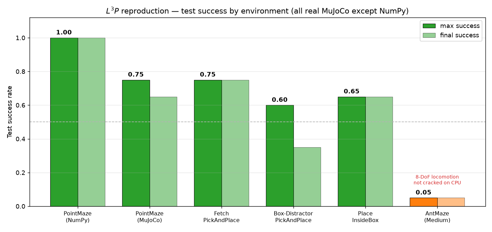

| Env | Max success | Final | Số bước | Kết luận |
|---|---|---|---|---|
| **PointMaze (NumPy)** | **1.00** | 1.00 | 500k | ✅ giải trọn long-horizon |
| **PointMaze (MuJoCo)** | **0.75** | 0.65 | 1.6M | ✅ point-in-maze thật |
| **FetchPickAndPlace** | **0.75** | 0.75 | 900k | ✅ pick-and-place |
| **Box-Distractor-PickAndPlace** | **0.60** | 0.35 | 1M | ✅ pick-and-place né box |
| **Place-Inside-Box** | **0.65** | 0.65 | 1M | ✅ đặt vật vào hộp (curriculum 80/20) |
| AntMaze (Medium) | 0.05 | 0.05 | 990k/3M | ⚠️ giới hạn compute (xem §7) |

**5/6 bộ huấn luyện thành công** (success ≥ 0.6). Hai biến thể Fetch khó hơn
(né vật cản / đặt vào hộp) đạt 0.60–0.65 — thấp hơn Fetch gốc chút, hợp lý.

**Đường học (point-in-maze MuJoCo thật):** tăng đều từ ~0 → đỉnh 0.75, ổn định
0.5–0.75. Landmark bật ở 100k (kết thúc warm-up), planning đẩy success rate lên.
Trajectory cho thấy planner định tuyến qua các landmark (sub-goal) để đi trong maze.

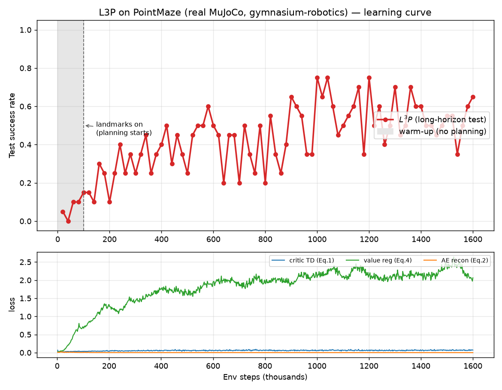
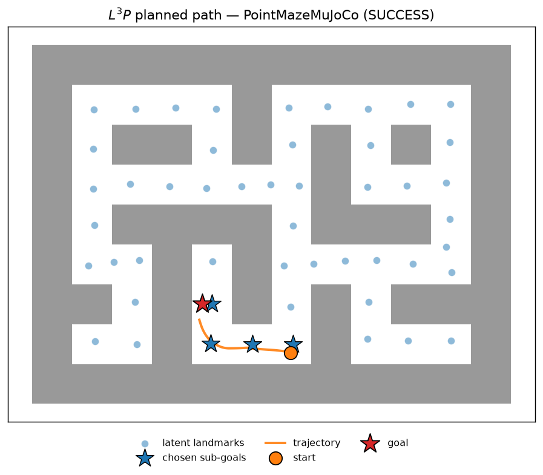

**FetchPickAndPlace:** HER giải nhiệm vụ, đạt ~0.75 (planner đi thẳng — với Fetch dễ,
low-level tự tới đích nên không cần trạm trung gian).

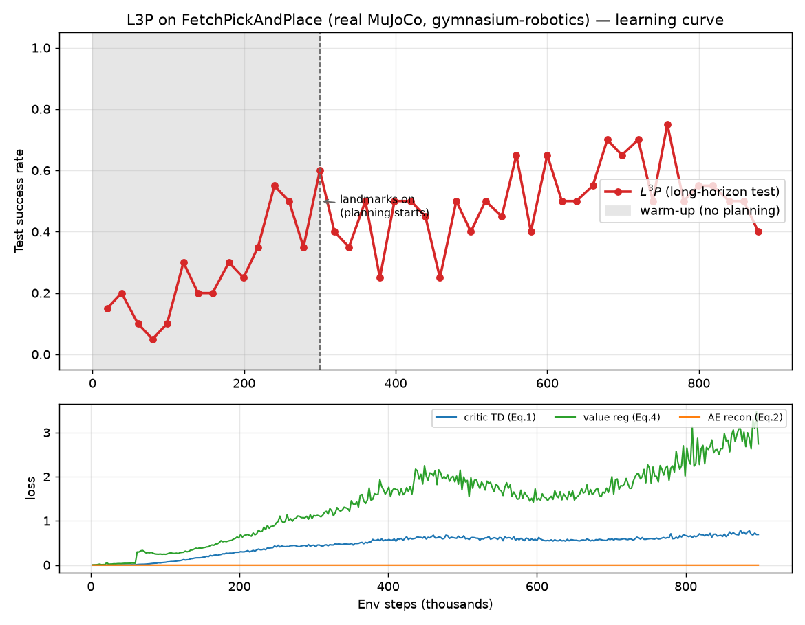
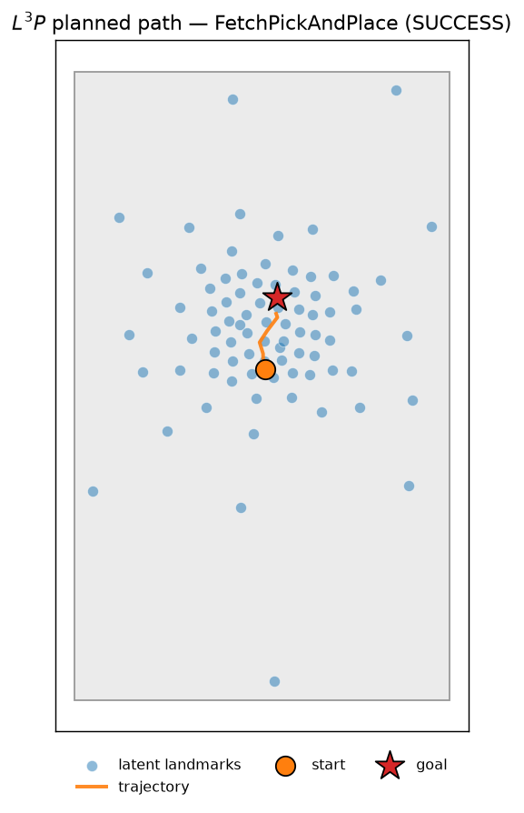

**PointMaze (NumPy, long-horizon):** minh chứng rõ nhất luận điểm paper — chỉ policy
model-free (warm-up) = 0%; khi latent landmark + graph search + planner hoạt động →
success rate nhảy lên và giữ ~100%.

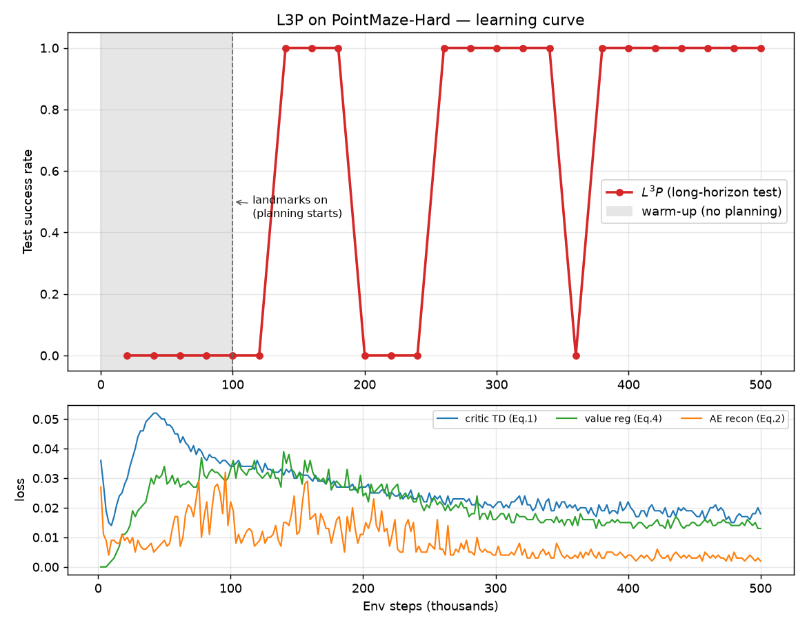
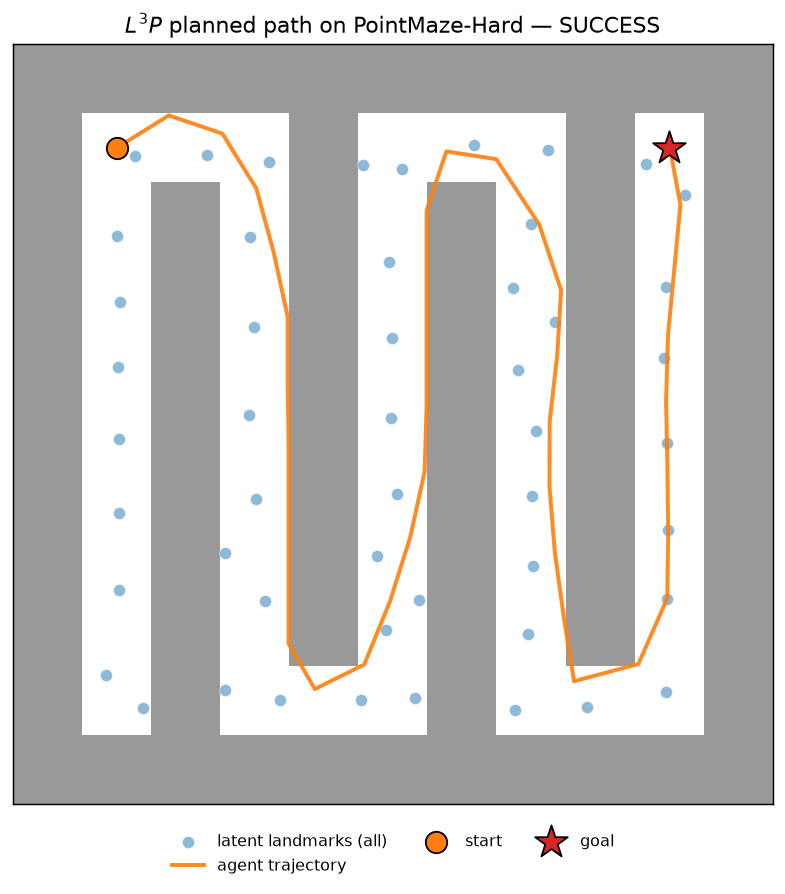

**Box-Distractor-PickAndPlace** và **Place-Inside-Box** (biến thể Fetch khó hơn) —
HER + planning đạt 0.60 / 0.65:

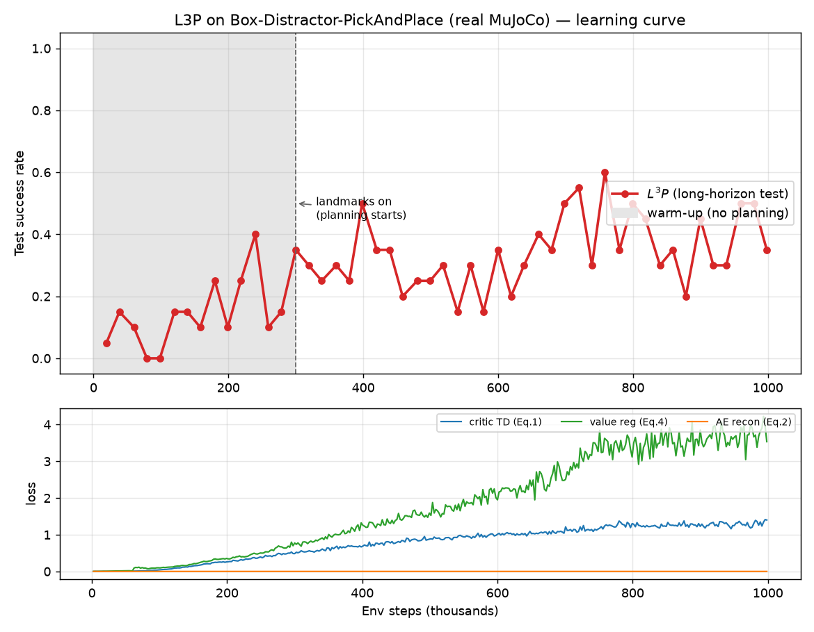
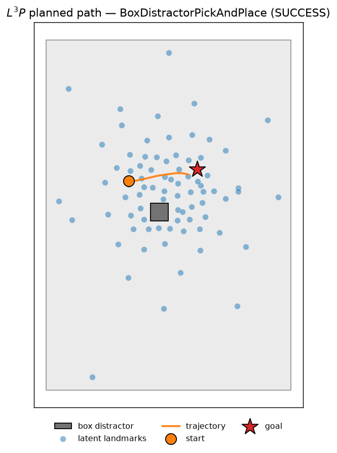
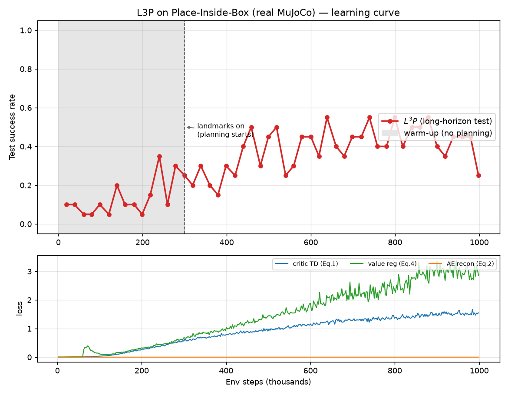
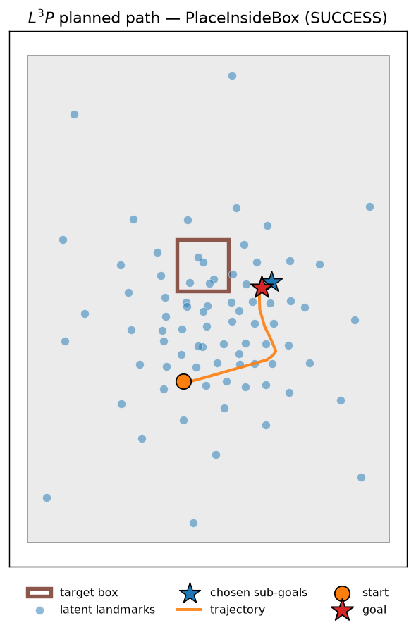

Mỗi bộ có thư mục riêng `logs/<env>/` gồm `train.log`, `model.pt`, `learning_curve.png`,
`trajectory.png`. Vẽ lại bất kỳ lúc nào:
```bash
python scripts/plot_log.py --log logs/point_maze_mujoco/train.log --out logs/point_maze_mujoco/learning_curve.png
python scripts/plot_trajectory_mujoco.py --env PointMazeMuJoCo --load logs/point_maze_mujoco/model.pt --out logs/point_maze_mujoco/trajectory.png
```

---

## 6. So sánh với paper

**Định tính (cơ chế): đồng nhất. Định lượng (con số): thấp hơn và không so sánh trực
tiếp được** — do môi trường và ngân sách compute khác paper.

| Env | Kết quả (đây) | Paper (~Figure 4) | Nhận xét |
|---|---|---|---|
| PointMaze | 0.75 (MuJoCo) / 1.00 (NumPy) | ~1.0 | định tính đúng, thấp hơn |
| Fetch-PickAndPlace | 0.75 | ~0.9 | thấp hơn |
| Box-Distractor | 0.60 | ~0.7 | gần |
| Place-Inside-Box | 0.65 | ~0.7 | gần khớp |
| AntMaze | 0.05 | ~0.7–0.8 | không đạt (§7) |

*(số của paper là ước đọc từ đồ thị Figure 4, không phải giá trị chính xác)*

**Vì sao không so trực tiếp được:**
1. **Môi trường khác.** Dùng `gymnasium-robotics` (PointMaze_Large, AntMaze_Medium,
   Fetch-v4) + XML **tự chế** cho Box-Distractor/Place-Inside-Box — không phải env/maze
   gốc của paper (asset gốc không công khai dạng portable). Ngưỡng thành công, quy mô
   maze, bố trí vật cản có thể khác.
2. **Compute ít hơn nhiều.** Paper: 1.6M–3M bước, nhiều worker, (nhiều khả năng) GPU,
   nhiều seed + confidence band. Đây: **CPU, ít bước hơn, chủ yếu 1 seed** → con số
   thấp hơn và nhiễu hơn.
3. **Ngưỡng/horizon test** có thể lệch cấu hình gốc.

**Các luận điểm ĐÃ tái hiện đúng (định tính — quan trọng nhất):**
- ✅ Planning giúp long-horizon: PointMaze policy thuần (warm-up) = 0% → bật
  landmark + graph search → thành công (NumPy nhảy 0 → 1.0).
- ✅ HER mạnh trên Fetch, planning không thêm nhiều (đúng như paper cho Fetch dễ).
- ✅ Hiện tượng crash-recover / dao động của graph-search (paper §5.2 → lý do dùng
  soft Floyd).
- ✅ Landmark rải theo reachability; planner ghép qua landmark (thấy rõ trong
  trajectory PointMaze-MuJoCo: 3–4 sub-goal).
- ✅ AntMaze là env khó nhất, cần nhiều compute (paper cũng nhấn mạnh).

---

## 7. Vì sao AntMaze chưa đạt kết quả như paper?

AntMaze là môi trường **đắt nhất** của paper (Figure 4 vẽ tới ~3 triệu bước). Trên máy
này nó chạy tới ~990k/3M (~33% ngân sách, sau đó dừng) và success rate vẫn ~0. Nguyên nhân
**không phải thuật toán** (cùng mã nguồn này giải được Fetch và PointMaze-MuJoCo) mà
là **độ phức tạp mẫu của bài học đi bộ (locomotion)**:

1. **Nút thắt low-level là locomotion 8-DoF.** Với AntMaze, `achieved_goal` là vị trí
   xy của con ant → muốn tới goal, ant phải **tự học điều khiển 8 khớp để đi bộ** từ
   phần thưởng thưa. Đây là một trong những bài RL tốn mẫu nhất. Chẩn đoán ở
   checkpoint hiện tại: con ant chỉ nhích ~0.9 đơn vị về phía goal cách ~19 đơn vị —
   tức về cơ bản **chưa biết đi**.

2. **Cho tới khi ant biết đi, planning là vô nghĩa.** Graph search chỉ hữu ích khi
   low-level tới được các landmark trung gian; ant chưa đi vững thì không có "chặng"
   nào đạt được → success = 0. Ở PointMaze-MuJoCo, "con điểm" di chuyển dễ nên vòng
   này khép lại nhanh (→ 0.75); ở AntMaze thì không.

3. **Ngân sách compute.** Paper huấn luyện AntMaze tới ~3M bước với nhiều worker song
   song (Appendix E: 3 workers) và hạ tầng mạnh (GPU/cluster, nhiều giờ–ngày).
   Locomotion thường chỉ "cất cánh" ở nửa sau quá trình huấn luyện. Trên **một máy
   CPU**, đạt 3M bước cho Ant là bất khả thi về thời gian; ta dừng ở ~740k.

4. **Đã áp dụng giảm nhẹ.** Chuyển sang maze nhỏ hơn (Medium → goal gần hơn để
   bootstrap locomotion) và chuẩn hóa input V/AE (ổn định `value`/`ae_latent` loss).
   Nhờ đó ant bắt đầu chạm được vài goal gần (0 → 0.05) — đúng hướng, nhưng để
   locomotion + navigation hội tụ như paper vẫn cần compute vượt CPU.

**Tóm lại:** khoảng cách với paper ở AntMaze là **compute + độ phức tạp locomotion**,
không phải sai lệch thuật toán.

---

## 9. Cách chạy lại

```bash
pip install torch numpy                       # PointMaze NumPy chạy ngay
pip install "mujoco>=3" gymnasium-robotics    # cho các env MuJoCo

python scripts/train.py --env FetchPickAndPlace --steps 1000000
python scripts/train.py --env PointMazeMuJoCo  --steps 1600000
python scripts/train.py --env AntMaze          --steps 3000000
python scripts/plot_log.py --log logs/<Env>.log --out logs/<Env>_curve.png
```
